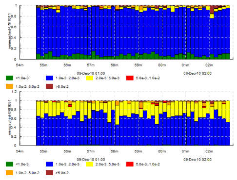
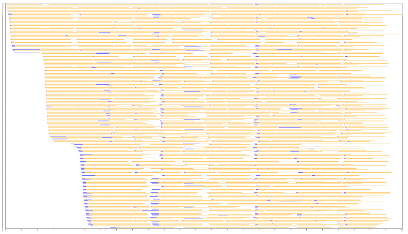
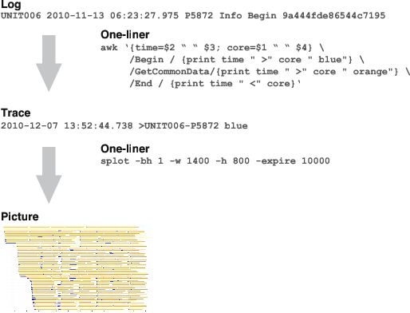

.. _introduction:

Introduction
=======================

**splot** and **timeplot** are tools for visualizing temporal data, especially useful for visualizing data from program logs.

You can get them and see the installation instructions at http://jkff.info/software/timeplotters (though native packages are not always up-to-date with the latest code). 

The code is hosted at http://github.com/jkff/timeplot and http://github.com/jkff/splot. This manual's source is hosted at http://github.com/jkff/timeplotters-doc.

For any questions, bugs or suggestions, write me at mailto:ekirpichov@gmail.com or submit a github issue or pull request. 

Both tools are heavily battle-tested and evolved in response to concrete visualization requirements at a large-scale cluster computing project which the author was part of, though the tools are in no way bound to this particular domain.

**timeplot** draws quantitative graphs about several streams of events happening over time, e.g. you can use it to compare the distribution of database access latencies from two machines; to draw the number of requests being concurrently processed by each server at each moment, etc.

**splot** draws a single Gantt-like chart with a birds-eye view of the activity of a number of concurrent processes, color-coding the state of each process at each moment (e.g. processing one of several jobs, or being in a particular stage of processing). This allows to see peculiar system-level behavior patterns and usually allows to instantly isolate system-level performance bottlenecks which very often show themselves as distinct visual patterns. Section :ref:`splot-motivation` gives an example of what non-trivial aspects of a program's behavior **splot** can show.

**These characteristics** make the tools useful for exploratory analysis:

* **Input is trivial to generate** from raw logs by usual text processing tools such as awk or perl
* You can generate **different plots from the same input**
* Fast enough to draw **many millions of events** in tens of seconds, potentially unlimited input size
* Tools are invoked by **one-liners**

Both **timeplot** and **splot** accept input in a strictly specified format, not arbitrary logs. A file in this format is called **trace**. However, this format is designed to be trivial to generate from log files, e.g. using text processing tools such as awk, sed or perl. I use **awk**, it shines at one-liners (google "awk one-liners").

The general pattern of usage is displayed on the next figure: you use an awk one-liner to generate the **trace** and invoke the tool on it.

Example: ::

    $ awk '/some log entry/{emit an event into trace} \
           /another log entry/{emit another event...}' \
           log.txt > trace.txt
    $ splot -if trace.txt -o picture.png ..options..

**Let us look at a real-life example** without considering it in too much detail. Use it only for the purpose of understanding the general pattern of usage.

In this example, we're drawing the activity of a computational cluster using **splot**. There's a bunch of worker processes which process tasks from a shared queue. Every task has two stages: 1) fetch data from memcached and 2) run computations. **Here we'll just show how to run the tool, and not explain what the parameters or even the result mean.**

The log entries look like this:

+------------+-----------------------------+------------+-----------+------------------+---------------+
|Machine     | Date/time                   | Process ID | Level     | Operation        | Task ID       |
+------------+-----------------------------+------------+-----------+------------------+---------------+
|``UNIT011`` | ``2010-12-09 01:54:41.853`` | ``3964``   | ``Debug`` | ``GetCommonData``|``390256d1/49``|
+------------+-----------------------------+------------+-----------+------------------+---------------+

Operation can be one of ``Begin`` (starting a task), ``GetCommonData`` (finished getting task data from database, starting computations), ``End`` (computations for a task finished).::

    $ awk '{time=$2 " " $3; core=$1 " " $4} \
           /Begin /       {print time " >" core " blue"} \
           /GetCommonData/{print time " >" core " orange"} \
           /End /         {print time " <" core}' log.txt > trace.txt
    $ splot -if trace.txt -o splot.png -bh 1 -w 1400 -h 800 -expire 10000

You can see that it took just 2 commands to produce a picture.

The picture is actually very interesting and highlights many performance problems in the original program. The curious reader is advised to look at section :ref:`splot-motivation` where we discuss this case in detail.

Now let's consider the tools in detail.
