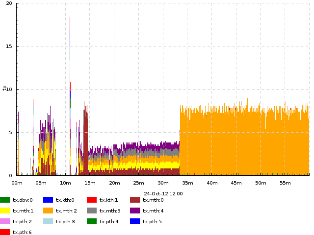
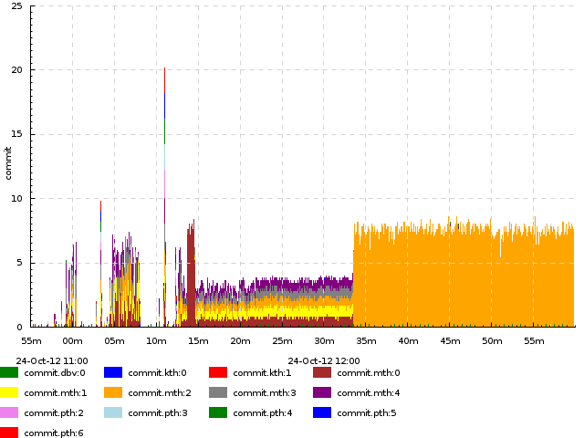

*By Eugene Kirpichov <ekirpichov@gmail.com>*

**splot** and **timeplot** (*timeplotters*) are command-line tools for visualizing temporal data, especially useful for visualizing data from ad-hoc program logs to help you spot patterns and anomalies that you would not spot otherwise (by just watching how the program works, or by looking at the logs with the naked eye).

Visualization can provide huge insight into the program behavior, help you find complex bottlenecks and give you a lot of "aha!" moments. It's also fun.

The tools take input in a simple text format that's easy to generate from a typical log file, and produce an image file.

They have been specifically designed for working with program logs: the input format is tailored to event types typically seen in program logs and the visualization methods are tailored to the questions typically asked about program performance (e.g. distribution of activity durations).

                                                      
  An example of **timeplot**                          
.. figure:: pics/splot/splot-main-example.png
  :width: 40%                               
  :align: center                             
                                             
  An example of **splot**                    

How is this better than Excel, R or gnuplot?
^^^^^^^^^^^^^^^^^^^^^^^^^^^^^^^^^^^^^^^^^^^^

**Timeplotters:** You take a log, write a **one-liner to produce input** for the tools, write a **one-liner to plot a graph** of interest. It takes 1 minute and gives you instant gratification. You find something peculiar in the graph and decide to look at the same log from a different perspective. It takes you another 1 minute to do so.

**Excel or R:** You take a log, come up with the kind of columns you'll have in your CSV, write a small program to produce the CSV from the raw log, or perhaps even modify the original application to write logs better suited for converting to Excel input (because the inputs Excel can visualize do not match closely with what logs usually contain, e.g. to determine the delay between two events in your program, you'll have to do time arithmetic yourself), open Excel, import the CSV and somehow plot it. It takes... well, a while, and next time you're just too lazy to do it again. Sloth inhibits curiosity.

To see how **timeplotters** compares to your favourite visualization tool, we suggest to start by replicating the example from "Getting your hands dirty" below.

For some plot types, you can get pretty close with the magnificent `ggplot2 <http://ggplot2.org/>`_ . Some things are not easily possible in Excel, R or gnuplot at all, e.g. the entire **splot** or **timeplot**'s "activity counters" and duration-based plots. On the other hand, **timeplotters** can only plot data where the X axis is time.

Installation from binaries
^^^^^^^^^^^^^^^^^^^^^^^^^^
*(skip this step on Windows)* Install `Cairo runtime libraries <http://cairographics.org/>`_:

* **Linuxes**: ``sudo apt-get install libcairo``, or ``sudo yum install libcairo`` or like that.
* **Mac OS X + MacPorts**: ``sudo port install cairo``
* **Mac OS X + HomeBrew**: Install `XQuartz <http://xquartz.macosforge.org/landing/>`_, then ``brew install cairo``

**Ubuntu binaries**: http://jkff.info/software/timeplotters/timeplotters-1.0_ubuntu_amd64.tar.gz

**OSX binaries**: http://jkff.info/software/timeplotters/timeplotters-1.0_osx.tar.gz

**Windows binaries**: http://jkff.info/software/timeplotters/timeplotters-0.1-7_win32.zip

**CentOS/RHEL binaries** (generously provided by Evgeny Tarasov): `splot-0.3.6-1.el6.i386.rpm <http://jkff.info/software/timeplotters/splot-0.3.6-1.el6.i386.rpm>`_, `splot-0.3.6-1.el6.x86_64.rpm <http://jkff.info/software/timeplotters/splot-0.3.6-1.el6.x86_64.rpm>`_, `splot-0.3.6-1.i386.rpm <http://jkff.info/software/timeplotters/splot-0.3.6-1.i386.rpm>`_, `splot-0.3.6-1.x86_64.rpm <http://jkff.info/software/timeplotters/splot-0.3.6-1.x86_64.rpm>`_, `timeplot-1.0.18-1.el6.i386.rpm <http://jkff.info/software/timeplotters/timeplot-1.0.18-1.el6.i386.rpm>`_, `timeplot-1.0.18-1.el6.x86_64.rpm <http://jkff.info/software/timeplotters/timeplot-1.0.18-1.el6.x86_64.rpm>`_, `timeplot-1.0.18-1.i386.rpm <http://jkff.info/software/timeplotters/timeplot-1.0.18-1.i386.rpm>`_, `timeplot-1.0.18-1.x86_64.rpm <http://jkff.info/software/timeplotters/timeplot-1.0.18-1.x86_64.rpm>`_

Installation from source
^^^^^^^^^^^^^^^^^^^^^^^^

* Install `Haskell Platform <http://hackage.haskell.org/platform/>`_
* Install `Cairo run-time and development libraries <http://cairographics.org/>`_ as above (Linuxes: ``sudo apt-get install libcairo libcairo-dev`` or alike; Mac: the above procedure with HomeBrew or MacPorts will be sufficient)
* *(Mac+HomeBrew only)* ``export PKG_CONFIG_PATH="/opt/X11/lib/pkgconfig:$PKG_CONFIG_PATH"``
* Then perform these commands::

    cabal update
    cabal install gtk2hs-buildtools
    cabal install timeplot splot

  Or just ``git clone`` the repos and do ``cabal install`` inside the cloned directories.

The code is hosted at http://github.com/jkff/timeplot and http://github.com/jkff/splot . This manual's source is hosted at http://github.com/jkff/timeplotters-doc .

Feedback
^^^^^^^^
For any questions, bugs or suggestions, write me at mailto:ekirpichov@gmail.com or submit a github issue or pull request. 

Get your hands dirty
^^^^^^^^^^^^^^^^^^^^
After blindly following this section, you'll get a feel for what it's like to use these tools. Read the rest of the documentation to understand more.

**Download the example log:** *(generously provided by Paul Graphov)* http://jkff.info/datasets/tplot-tutorial.tar.gz. This is a log of DrWeb Antivirus Server. One of the interesting parts is events relating to DB transactions::

    20121024.114904.78 db3 [  415   449] mth:2  [DB] Successful BEGIN transaction, 00.000 wait
    20121024.114904.78 db3 [  415   449] mth:2  [IntDB] Statement "..."
    20121024.114904.78 db3 [  415   449] mth:2  [DB] OK, 00.000, ...
    20121024.114904.78 db3 [  415   449] mth:2  [IntDB] Statement "..."
    20121024.114904.78 db2 [  415   449] mth:2  [DB] 1 row, 00.000, ...
    20121024.114904.78 db3 [  415   449] mth:2  [IntDB] Statement "..."
    20121024.114904.78 db2 [  415   449] mth:2  [DB] 79 rows, 00.000, ...
    20121024.114904.78 db3 [  415   449] mth:2  [IntDB] Statement "COMMIT"
    20121024.114904.78 db3 [  415   449] mth:2  [DB] Database has been freed but nobody wants it now 
    20121024.114904.78 db3 [  415   449] mth:2  [DB] Successful COMMIT transaction, 3 statements, 00.000 wait, 00.000 execute, 00.000 commit

**Generate input for timeplot:** we're going to plot transaction commit rate::

    $ awk '/Successful COMMIT/{print $1 " !commit." $6}' tplot-tutorial.log > commit.trace
    $ head commit.trace
    20121024.115520.85 !commit.dbv:0
    20121024.115537.31 !commit.kth:1
    20121024.115621.03 !commit.dbv:0
    20121024.115707.44 !commit.mth:0
    ...

**Invoke timeplot** to build a graph of transaction commit rates by thread id (the part after ".")::

   $ tplot -if commit.trace -o commit.png -tf '%Y%m%d.%H%M%OS' -dk 'within[.] acount 5'

**Behold the result:**

This shows the total transaction commit rate per second and how it adds up from commits of transactions in individual threads.

Now you know what to expect and are perhaps interested in learning more. If so, read on.

.. _introduction:

Actual introduction
===================

**timeplot** draws quantitative graphs about several streams of events happening over time, e.g. you can use it to compare the distribution of database access latencies from two machines; to draw the number of requests being concurrently processed by each server at each moment, etc.

.. image:: pics/tplot/tplot-motivating-example.png
  :align: center

**splot** draws a single Gantt-like chart with a birds-eye view of the activity of a number of concurrent processes, color-coding the state of each process at each moment (e.g. processing one of several jobs, or being in a particular stage of processing). This allows to see peculiar system-level behavior patterns and usually allows to instantly isolate system-level performance bottlenecks which very often show themselves as distinct visual patterns. Section :ref:`splot-motivation` gives an example of what non-trivial aspects of a program's behavior **splot** can show.

.. image:: pics/splot/splot-main-example.png
  :width: 50%
  :align: center

**These characteristics** make the tools useful for exploratory analysis:

* **Input is trivial to generate** from raw logs by usual text processing tools such as awk or perl
* You can generate **different plots from the same input**
* Fast enough to draw **many millions of events** in tens of seconds, potentially unlimited input size
* Tools are invoked by **one-liners**

Both **timeplot** and **splot** accept input in a strictly specified format, not arbitrary logs. A file in this format is called **trace**. However, this format is designed to be trivial to generate from log files, e.g. using text processing tools such as awk, sed or perl. I use **awk**, it shines at one-liners (google "awk one-liners").

The general pattern of usage is displayed on the next figure: you use an awk one-liner to generate the **trace** and invoke the tool on it.

.. image:: general-usage.png
  :width: 50%
  :align: center

Example: ::

    $ awk '/some log entry/{emit an event into trace} \
           /another log entry/{emit another event...}' \
           log.txt > trace.txt
    $ splot -if trace.txt -o picture.png ..options..

**Let us look at a real-life example** without considering it in too much detail. Use it only for the purpose of understanding the general pattern of usage.

In this example, we're drawing the activity of a computational cluster using **splot**. There's a bunch of worker processes which process tasks from a shared queue. Every task has two stages: 1) fetch data from memcached and 2) run computations. **Here we'll just show how to run the tool, and not explain what the parameters or even the result mean.**

The log entries look like this:

+------------+-----------------------------+------------+-----------+------------------+---------------+
|Machine     | Date/time                   | Process ID | Level     | Operation        | Task ID       |
+------------+-----------------------------+------------+-----------+------------------+---------------+
|``UNIT011`` | ``2010-12-09 01:54:41.853`` | ``3964``   | ``Debug`` | ``GetCommonData``|``390256d1/49``|
+------------+-----------------------------+------------+-----------+------------------+---------------+

Operation can be one of ``Begin`` (starting a task), ``GetCommonData`` (finished getting task data from database, starting computations), ``End`` (computations for a task finished).::

    $ awk '{time=$2 " " $3; core=$1 " " $4} \
           /Begin /       {print time " >" core " blue"} \
           /GetCommonData/{print time " >" core " orange"} \
           /End /         {print time " <" core}' log.txt > trace.txt
    $ splot -if trace.txt -o splot.png -bh 1 -w 1400 -h 800 -expire 10000

.. image:: pics/splot/splot-main-example.png
  :width: 80%
  :align: center

You can see that it took just 2 commands to produce a picture.

The picture is actually very interesting and highlights many performance problems in the original program. The curious reader is advised to look at section :ref:`splot-motivation` where we discuss this case in detail.

Now let's consider the tools in detail.
