splot — visualizing behavior of many concurrent processes
=========================================================
**splot** draws a single Gantt-like chart with a birds-eye view of the activity of a number of concurrent processes, each of which may be in one of several different states at each moment (e.g. processing one of several jobs, or being in a particular stage of processing). 

The input to **splot**, in the basic form, is a sequence of events *activity started*, *activity finished* (specifying the timestamp and the process whose activity we're speaking about). Every event also includes a color with which to render the activity.

Simple example
--------------

This example has two tracks ``thread-1`` and ``thread-2`` and demonstrates most of the basic features::

  2010-10-21 16:45:12.014 >thread-2 blue
  2010-10-21 16:45:13.329 >thread-1 blue
  2010-10-21 16:45:13.635 <thread-1
  2010-10-21 16:45:13.800 <thread-2
  2010-10-21 16:45:13.810 >thread-1 blue
  2010-10-21 16:45:13.810 >thread-2 orange
  2010-10-21 16:45:14.010 >thread-1 orange
  2010-10-21 16:45:14.258 <thread-2
  2010-10-21 16:45:14.623 <thread-1
  2010-10-21 16:45:14.629 >thread-2 orange
  2010-10-21 16:45:15.138 >thread-1 orange
  2010-10-21 16:45:15.319 >thread-1 blue
  2010-10-21 16:45:15.502 <thread-1 red
  2010-10-21 16:45:15.502 !thread-1 black Hi there
  2010-10-21 16:45:16.112 <thread-2

Invoke **splot**::

  $ splot -if splot.simplest-example.trace \
          -o splot.simplest-example.png -w 480 -h 160 \
          -bh 5 -legendWidth 70

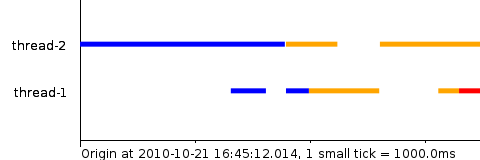

Please carefully examine how this corresponds to the trace above. This has no particular meaning — it's merely an illustration of the different types of events in the trace. The tracks are ordered by time of the first event, so ``thread-2`` is the top track on this picture.

.. _splot-motivation:

Motivation
----------

In this section we shall consider a plot and see how it helps highlight a number of problems in the program whose behavior was visualized, that would be difficult to find without **splot**.

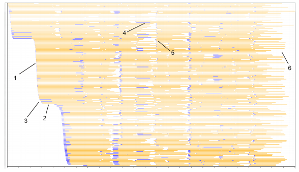

Here, the X axis is time, the Y axis is cluster worker (core), orange is computations and blue is fetching data from memcached.

There are several anomalies on this picture:

**1. Whitespace on the left: Slopes.** The beginning of the picture corresponds to the program startup — the first tasks are being fed into the shared queue and workers pick them up and start executing. **The whitespace** means that a large fraction of the program execution time is spent just warming up, while the workers essentially do nothing. **The slopes** mean that workers do not receive the first tasks instantly. Either it takes time to pick them from the queue, or they are being fed to the queue not quickly enough.

**2. Whitespace on the left: Plateaus.** The plateaus mean that there are moments when no tasks are being picked up at all. Either the queue is hung up, or the task producer. We also see how big an impact this has on the overall cluster utilization: a single 1-second plateau is worth 160 seconds of computations (as there are 160 workers on this picture)!

**3. The slope on the left is nonlinear.** The slope becomes less vertical at the end of each slope line. This means that task pickup rate (or perhaps task generation rate) is not constant. There's a "tail" in task delivery times. 

**4. Some blue bars are rather long.** This means that memcached fetches sometimes take a long time — comparable with computation time. We should optimize them.

**5. Vertical patterns of white space and blue bars lining up on their left edge.** This means that there are moments when everyone's got nothing to do and the task queue is empty, and then suddenly a lot of tasks appear in the queue and everyone is busy again. This is probably a problem with the task producer — maybe it is sending tasks in batches, or something like that.

**6. A lot of white space on the right.** This means that at the end of the program execution, when all tasks are already in the queue and no new ones will appear, a lot of time is spent when faster workers wait for slower workers. The program finishes when the very last worker finishes. The fraction of this whitespace is very well worth 5-10% of the total program time. This anomaly is called "the long tail effect" and can be eased by increasing the task granularity (i.e. submitting many short tasks rather than several long ones). However, this will obviously increase load on the queue, so we have a trade-off here.

We see that a simple picture of the cluster behavior showed us quite a few non-trivial problems, most of which would be very difficult to find without a visualization.

We shall now proceed to a formal description of the concepts and options used in **splot**.

Concepts
--------

Let us now consider in detail all the concepts necessary to understand and use **splot**.

**Track (also process)** — An entity which moves between several states (performs several activities) over time. At any moment, a process is doing at most one activity. We're usually interested in seeing the visual pattern emerging between different tracks. For example, it is often meaningful to assign 1 track = 1 thread in a multi-threaded program (in a distributed program one should of course include the machine into the track id). Tracks are identified by arbitrary strings.

**Activity** — A period during which a process is in a particular problem-specific logical state. A single activity is drawn with a single color, as a bar which is horizontally as long as the activity (if there are a lot of tracks, this bar can be as thin as a hairline). For example, if we have a program whose threads are either computing, doing IO or waiting idly, we may depict the "computing" activity with orange color, IO as blue and idle waiting as lack of activity (no color at all).

**Event** — Mark of the beginning or end of an activity on a particular track, specifying the activity's color. There are also "text" events which allow to draw text markers above the usual colored bars. An event has a timestamp, track and event type (activity start / activity end / text). For example, when our hypothetical program starts doing IO in thread T, we should represent this in **splot**'s input as an event "start blue activity on track T".

**Color** — Colors in **splot** can be specified in several ways. In the simplest form, it can be an SVG color name or hex code (e.g. ``red`` or ``lightblue`` or ``#ff0033``), it can be an arbitrary string (then a random color will be generated so that different strings correspond to different colors — this is useful to color-code an unknown number of different types of activities, e.g. if you have worker processes servicing several clients and you wish to get a picture of who services whom and color-code the clients: ``client-5``), and it can be an arbitrary string within a color scheme (e.g. ``/success/client-5`` or ``/failure/client-5``, and you might define the ``success`` colorscheme to consist of several greenish colors and ``failure`` of reddish).

**Color scheme** A list of colors which will be cycled between when generating colors for tracks whose color is not specified explicitly by a SVG color name or hex code.

Input format
------------

The input to **splot** consists of a series of events.

* ``TIME >TRK COLOR`` — Start activity of color COLOR on track TRK at time TIME (if there already is an activity, finish it and start a new one instead).

  **Example:** ``2010-10-21 16:45:09,431 >r2b3.t5 blue``

* ``TIME <TRK`` — Finish the current activity of track TRK at time TIME.
  
  **Example:** ``2010-10-21 16:45:10,322 <r23.t5`` 

* ``TIME <TRK COLOR`` — Finish the current activity of track TRK at time TIME, overriding the color it was given at the start by COLOR. This is useful, e.g. do indicate that an activity failed by drawing it with red color (obviously when the activity begins, we don't know if it will fail or not).

  **Example**: ``2010-10-21 16:45:10,322 <r2b3.t5 red`` 

* ``TIME !TRK COLOR TXT`` — Draw text TXT with color COL on track TRK, left-justified at time TIME.
  
  **Example**: ``2010-10-21 16:45:10,322 !r2b3.t5 black read()`` 

Advanced features
-----------------

Bar height
^^^^^^^^^^

Bar height is specified with ``-bh``: either ``-bh fill`` or ``-bh HEIGHT`` (e.g. -bh 5). ``fill`` means "set bar height to fill the whole vertical space". Consider the previous simple example, here it is with ``-bh fill``:

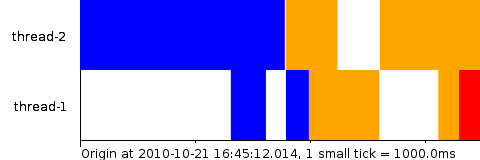

  A trivial example of **splot** usage with the ``-bh fill`` option

``-bh fill`` is vital when you have a lot of tracks (at least dozens). Perhaps it should be the default.

Expiring activities — if ``<`` is missing
^^^^^^^^^^^^^^^^^^^^^^^^^^^^^^^^^^^^^^^^^^^^^^^^

In systems where components can crash (which is, most systems :) ), it might happen so that your log catches only the beginning of an activity but not its end, because the component has crashed in the middle. You can tell **splot** "expire all activities if they take longer than X seconds" by using ``-expire X``; then, if an activity has not finished within X seconds, **splot** will draw a dashed line and an X marker, meaning that the process probably crashed somewhere on the dashed line.

Consider a small example similar to the one we had before::

  2010-10-21 16:45:12.014 >worker-2 blue
  2010-10-21 16:45:13.329 >worker-1 blue
  2010-10-21 16:45:13.635 <worker-1
  2010-10-21 16:45:13.800 <worker-2
  2010-10-21 16:45:13.810 >worker-1 blue
  2010-10-21 16:45:13.810 >worker-2 orange
  2010-10-21 16:45:14.010 >worker-1 orange
  2010-10-21 16:45:14.258 <worker-2
  2010-10-21 16:45:14.623 <worker-1
  2010-10-21 16:45:14.629 >worker-2 orange
  2010-10-21 16:45:15.138 >worker-1 orange
  2010-10-21 16:45:15.319 >worker-1 blue
  2010-10-21 16:45:16.512 <worker-2
  2010-10-21 16:45:18.412 >worker-2 blue
  2010-10-21 16:45:20.112 <worker-2

Let us draw it with an expiration time of 2000 milliseconds::

  $ splot -if splot.expire-example.trace -o splot-expire-example.png \
          -expire 2000 -bh 15 -w 480 -h 160 -legendWidth 70

Here's what we get:

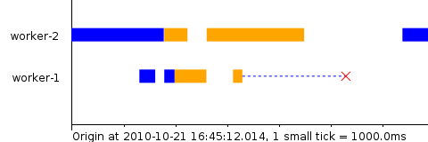

Here we see that perhaps "worker-1" (here drawn second, as its first event happened later than worker-2's) crashed and that's why it didn't do anything in the later parts of the graph.

And this is a more complex real-life example from a cluster (the input log has unfortunately been lost). Here a large number of workers are preempted at once.

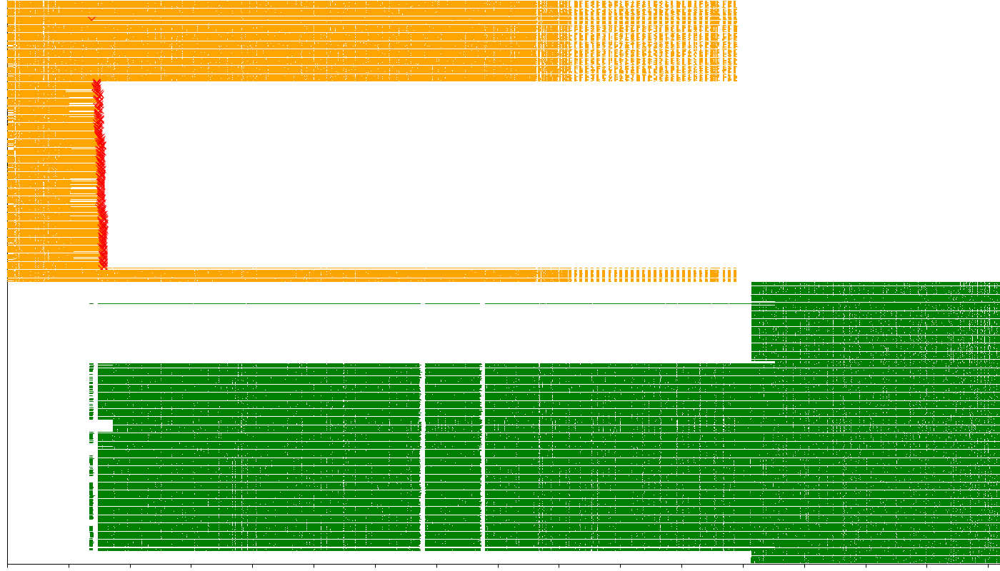

Phantom color — if ``>`` is missing
^^^^^^^^^^^^^^^^^^^^^^^^^^^^^^^^^^^^^^^^^^

Sometimes you process logs which start in the middle of the program's execution, so the log doesn't catch the beginning events of activities that were active at the moment the log was started (however, the log *does* catch their finishing events). **splot** can display such "phantom" activities in a color of your choice, using the ``-phantom COLOR`` option. Specifically, if a track starts with a ``<`` event instead of ``>``, then **splot** will assume that there was a ``>`` event with color COLOR in the past on this track.

Consider the same example as above, but let us cut it in the beginning, as if we had a truncated log::

  2010-10-21 16:45:14.010 >worker-1 orange
  2010-10-21 16:45:14.258 <worker-2
  2010-10-21 16:45:14.623 <worker-1
  2010-10-21 16:45:14.629 >worker-2 orange
  2010-10-21 16:45:15.138 >worker-1 orange
  2010-10-21 16:45:15.319 >worker-1 blue
  2010-10-21 16:45:16.512 <worker-2
  2010-10-21 16:45:18.412 >worker-2 blue
  2010-10-21 16:45:20.112 <worker-2

Now invoke **splot**::
  
  $ splot -if splot-phantom-simple-example.trace \
          -o splot-phantom-simple-example.png \
          -phantom gray -w 400 -h 160 -bh 5 

And here's what we get:

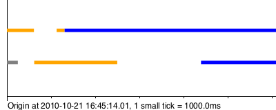

  Using the ``-phantom`` option with **splot**

We see a gray bar in the beginning of worker-2's track. This is because the first event on this track was ``2010-10-21 16:45:14.258 <worker-2``, i.e. an activity closing event, which means that the opening event was missed.

Color auto-generation
^^^^^^^^^^^^^^^^^^^^^

How do we color-code activities in **splot**'s input if the set of possible activity types is not known in advance? **splot** can generate colors automatically.

E.g. you have a set a of worker processes which service a fairly small but unknown number of clients. You assign tracks to worker processes, and you wish to color-code the clients to see a picture of who services whom and when.

In this case, you can simply use the client's id as color: for colors that do not parse as SVG color names or hex codes, **splot** will generate a random color from a default contrast color scheme.

Let us consider a real-life example. In this example, again some workers are processing tasks, but from different clients.
The trace looks like this: here, we use client ids as color codes (``8610``, ``877B`` etc.)::

  ...
  2011-07-27 02:42:03.485 <RACK5UNIT067.37dc
  2011-07-27 02:42:03.492 >RACK2UNIT067.4ca8 8610
  2011-07-27 02:42:03.495 >RACK4UNIT075.5b15 8610
  2011-07-27 02:42:03.496 >RACK4UNIT067.ec72 877B
  2011-07-27 02:42:03.496 >RACK4UNIT067.f3fe 877B
  2011-07-27 02:42:03.496 >RACK5UNIT017.0c21 8610
  2011-07-27 02:42:03.498 >RACK2UNIT030.9e7a 071C
  ...

So, we use track names of the form ``MACHINE.WORKERID`` and instead of using color at ``>`` events, we use the client ID, asking **splot** to color-code clients for us. Here red color denotes tasks that completed unsuccessfully and other colors (e.g. green and blue; red is excluded from the default color scheme precisely for situations like this) encode different clients *(Yes, as this rather crazy picture might hint, the program* **did** *have lots of problems — exposing them, that's what* **splot** *is for)*.

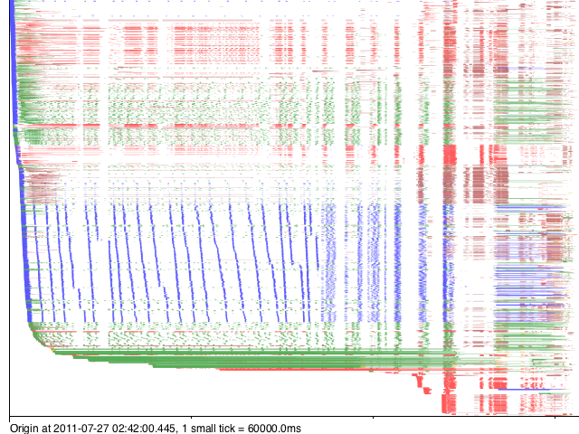

  Automatic color generation with **splot**

**Color schemes.** Assume the same case as above with worker processes servicing different clients. Assume also that worker processes might be in two modes: *regular* and *workstealing* (if they have nothing to do with their current client, they try to service tasks of some other client).

We wish to depict regular tasks and tasks picked by work-stealing in different shades: e.g. regular tasks as bright colors and work-stolen ones as pale. We still wish to use color generation for both. 

This can be achieved by using color schemes. Specifically, we'll color-core regular tasks by ``TIMESTAMP >WORKER CLIENT`` and work-stolen tasks by ``TIMESTAMP <WORKER /ws/CLIENT``. This tells **splot** to generate colors for regular tasks from the default color scheme and for work-stolen tasks from the ``ws`` color scheme, which we must specify in ``-colorscheme`` parameters, e.g. ``-colorscheme ws='lightblue lightgray pink beige'`` (use more colors if you wish to distinguish between more clients).

*(unfortunately, an example log illustrating this has been lost)*

Option reference
^^^^^^^^^^^^^^^^

.. list-table:: Option reference
  :widths: 5 20 5
  :header-rows: 1
  
  * - Option
    - Meaning
    - Default value
  
  * - ``-if INFILE``
    - Input filename
    - *Required*

  * - ``-o PNGFILE``
    - Output filename
    - *Required*

  * - ``-w WIDTH``  
    - Output width, pixels
    - ``640``

  * - ``-h HEIGHT`` 
    - Output height, pixels
    - ``480``

  * - ``-bh BARHEIGHT``
    - Vertical height of each track's activity bars, pixels, or ``fill`` to use all the available vertical space
    - ``fill``

  * - ``-tf PATTERN``
    - Format of time in the input file as in `man strptime <http://linux.die.net/man/3/strptime>`_ but with fractional seconds supported via ``%OS`` — will parse ``12.4039`` or ``12,4039``.  Also, ``%^[+-][N]s`` will parse seconds since the epoch, for example ``%^-3s`` are milliseconds since the epoch (N can only be 1 digit)
    - ``%Y-%m-%d %H:%M:%OS``

  * - ``-tickInterval MILLIS``
    - Ticks on the X axis will be this often
    - ``1000``

  * - ``-largeTickFreq N``
    - Every N'th tick will be larger than the others
    - ``10``

  * - ``-sort SORT``
    - Sort tracks by time of first event (``-sort time``) or by track name (``-sort name``) — see "track sorting" above
    - ``name``

  * - ``-expire MILLIS``
    - Expire activities that do not finish within MILLIS milliseconds — see "expiring activities" above
    - *none (don't expire)*

  * - ``-phantom COLOR``
    - Set the phantom color which is used if the first event on a track is ``<`` — see "phantom color" above
    - *none (no phantom color)*

  * - ``-fromTime TIME``
    - Clip the picture on the left (time in the format of ``-tf``, i.e. same as in the input)
    - *none (don't clip)*

  * - ``-toTime TIME``
    - Clip the picture on the right (time in the format of ``-tf``, i.e. same as in the input)
    - *none (don't clip)*

  * - ``-numTracks N``
    - Explicitly specify the number of tracks for better performance on very large data (see section "Performance" below)
    - *none (compute from input)*

  * - ``-colorscheme SCHEME COLORS``
    - Declare a colorscheme (see "Color schemes" above). Can be used multiple times. Scheme is an arbitrary string, e.g. ``pale`` or ``bright``. COLORS is a space-separated list of colors in SVG or hex, e.g. ``'red green 0x0000FF'``
    - *none*

  * - ``-legendWidth WIDTH``
    - Allocate WIDTH pixels to a legend to the left of the plot area
    - *none*

Gallery
^^^^^^^
The next figures show a number of pictures produced by **splot** in various real-life situations. Most of them look really creepy and expose different kinds of performance problems in the programs whose behavior they depict. The author already does not remember the precise reasons for the problems — think of it as a horror museum exposition and use your imagination.

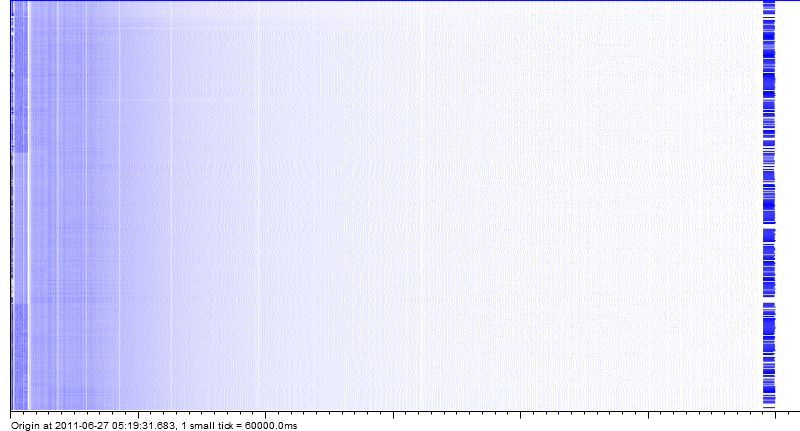

  Blue: working, white: waiting. The task queue's performance was gradually becoming worse and worse, until the job completed and another job started.

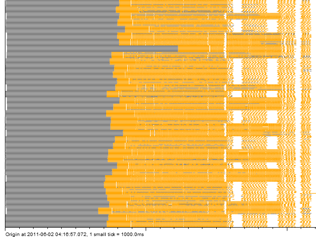

  Orange: working, gray: starting, white: waiting. The first time a program loads, it takes a long time. Loads on the same machine take the same time — .NET DLL caching (here the sort-by-track-name option is used, currently absent until reimplemented). The gray "gradient" is actually just a moire pattern.

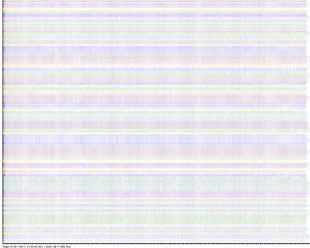

  Colors encode which shard of a task queue was being used. Initially the shards are fast, then they run slower but smoothly. Everything's fine.

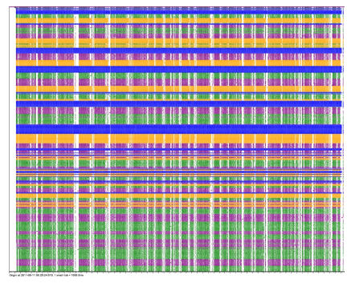

  Colors encode which shard of a task queue was being used. Green and purple have problems, yellow and orange don't. Turned out green and purple corresponded to the same physical queue server which had to sustain double load.

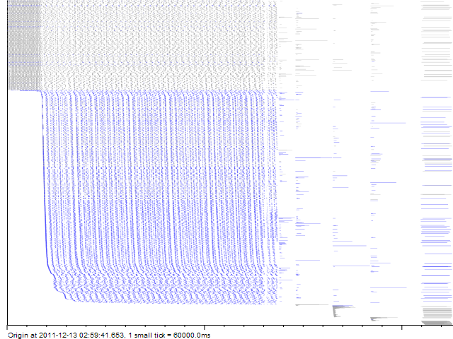

  Gray: normal tasks, blue: tasks picked by workstealing. After some period, workstealing begins and many workers start processing the job — slowing down the queue, but total throughput is higher.

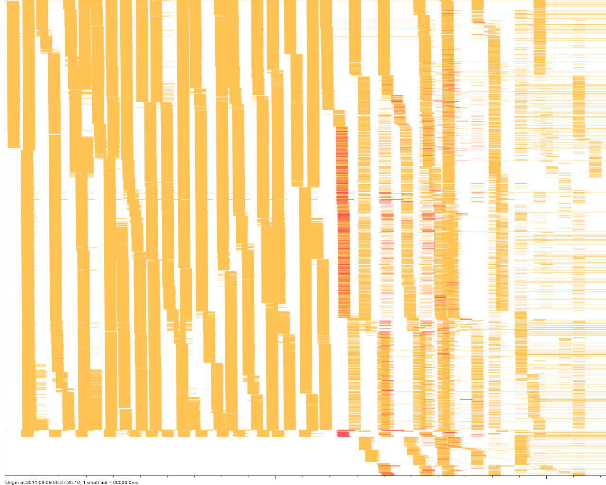

  Orange: working, red: preempted and lost work. The task queue prefetch feature was broken, leading to very strange patterns of task queue utilization.

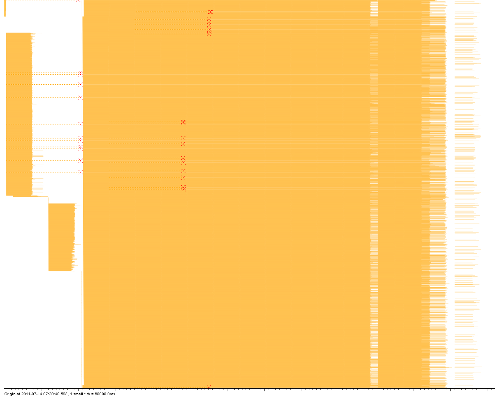

  A simple 2-stage job: a couple of insufficiently parallel data preparation steps, then a long stream of tasks utilizing the cluster well. Two worker machines died in the process.

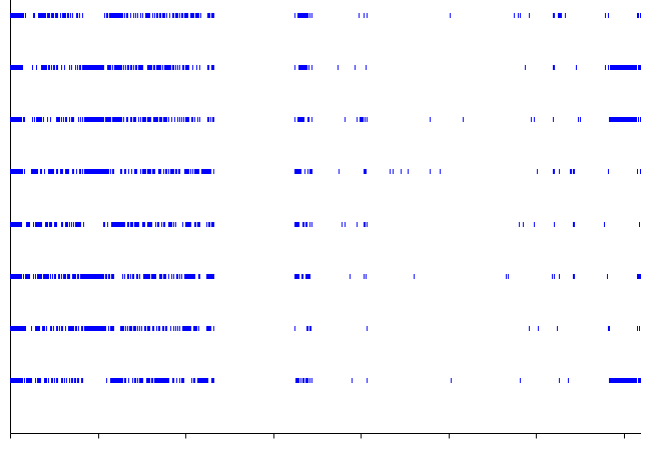

  Bars correspond to a web service being called from different threads. Apparently there are periods when it takes longer, and periods when it's not called at all.

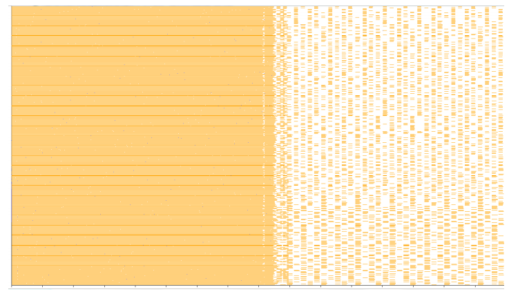

  Several jobs run concurrently and saturate the cluster. Then all but one finish, and the one remaining runs in bursts of tasks, these bursts being not parallel enough to saturate the cluster (I recall it was a 480-core cluster and 160-task bursts).

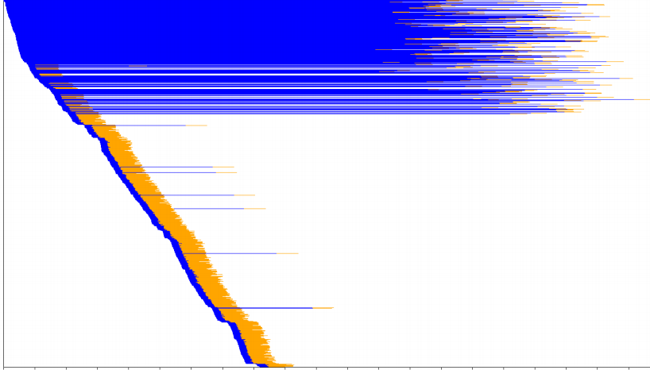

  Orange: working, blue: fetching from memcached. We see that early calls to memcached take a ridiculous amount of time. Later calls sometimes take long too, but not that long (I recall the reason was a broken retry mechanism).

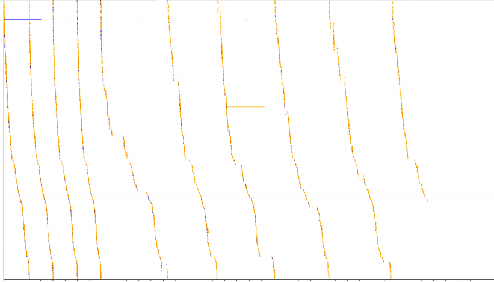

  There are 1900 tracks (cluster cores) here. The tasks that we put into the shared queue are by far too short, so the queue (and perhaps the task producer) becomes the bottleneck. We also see that the queue feeds tasks to workers in round-robin. And we also see that it slows down over time. And small pauses in the queue or task producer cost an awful amount of computing time because everyone is waiting for them.

