timeplot
========

**timeplot** allows you to visualize temporal data in different ways, with the intention to help you spot patterns. It takes as input a sequence of events in a fixed format (there are several types of events), and draws the quantitative characteristics of that sequence in many different ways — e.g. you can **compare the frequency** of different types of events per time unit, or to look at the distribution of **event durations**, etc.

**The input** to **timeplot** is a sequence of events of the form *event X happened*, *interval event X started/finished*, *a numeric or discrete variable P took value X*. Every event happens on a particular *input track* and at a particular time. The types of events are specified in section :ref:`tplot-input-format`. Different types of events can be used with different types of visualizations.

**The output** is a vertical stack of plots with a common time axis. Each plot corresponds to one *output track*. Usually *input tracks* correspond to output tracks 1-to-1, but sometimes the relation is more complex (multiple tracks on 1 plot, or 1 track on multiple plots) — see :ref:`tplot-concepts`. Every output plot is one of several types (e.g. simple dot plot, line plot, quantile plot, etc.). The kind of plot to draw on a particular output track is specified by the *plot kind mapping*, also described in section :ref:`tplot-concepts`.

An example result of **timeplot** is shown below:

.. _tplot-motivating-example:
.. figure:: pics/tplot/tplot-motivating-example.png
  :figwidth: 60%
  :align: center

  **timeplot** example: distribution of memcached access latencies from the same rack and from a different rack. Built from a log that had entries about starts and completions of requests to memcached.


.. _tplot-simple-example:

Simple example
----------------
This section considers in detail the simplest and most intuitive example possible: a dot plot of a single time-varying value.

Assume that we have a program that sometimes does requests to a database server (*Arcadia* — this is a real-life example from Yandex, and Arcadia is the codename of its core search engine) and logs their durations::

    ...
    2010-05-11 18:25:05.435 Arcadia request took 820 ms
    ...

We're interested in looking at the structure of these durations and its change over time. A simple dot plot is a perfect starting point.

First, **generate the trace**: for each line of interest in the log, we need to emit a corresponding *numeric measurement* event into the trace (see reference on event types in section :ref:`tplot-concepts` and on their textual format in section :ref:`tplot-input-format`).

The trace should look like this::

    ...
    2010-05-11 18:25:05.435 =arc 820
    ...

This is trivial to achieve with an awk one-liner::

    $ awk '/Arcadia req/{print $1 " " $2 " =arc " $6}' log.txt > trace.txt

Now we can **generate the plot**: we need to tell **timeplot** the input and output filenames and what kind of chart to draw::

    $ tplot -if trace.txt -o arc.png -dk dots

The parameter ``-dk`` means *default chart kind*: just draw all tracks (in this case the only track) using this kind of chart (``dots``). So, the track mapping process is involved here in the most trivial form (see section :ref:`tplot-track-mapping` for less trivial forms).

And we get this:

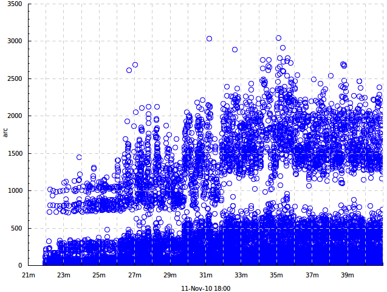

We see the following features:

* The times clearly split into higher and lower values, obviously corresponding to cache hits and cache misses within Arcadia.
* At some point the distribution suddenly changes to the worse and requests start taking more time. I do not remember what was the reason for that, but there certainly was one.
* There's a lot of overplotting on the picture; it's difficult to understand the distribution more precisely. To do that, we'll need quantile plots or bin plots (see section :ref:`tplot-plot-kinds` ). An alternative is to use semi-transparent dots (e.g. ``-dk 'dots 0.3'`` would give 30% opacity). There exist other ways of coping with overplotting (just google *overplotting*), but they're not currently implemented in **timeplot**.


**Where to go next:**

From this simple example you can go several ways:

* Get a glimpse of the power of **timeplot** in a more serious example — continue to section :ref:`tplot-motivation` where a reasonably complex real-world example is considered.
* Explore the ways to **map event streams onto charts**: draw multiple tracks, display a single input data point on multiple charts or vice versa, display data points from multiple tracks on a single plot (e.g. a color-coded dot plot) — see section :ref:`tplot-track-mapping` .
* Learn to use the **more complex event types** (e.g. discrete, impulse, edge and interval events) and to draw other types of charts on them — read section :ref:`tplot-concepts` and continue to section :ref:`tplot-plot-kinds` .
* Draw more interesting **types of charts** — just go to section :ref:`tplot-plot-kinds` .
* Take a look at the **example charts gallery** and choose something that looks interesting or applicable to your case — go to section :ref:`tplot-gallery` .


.. _tplot-motivation:

Motivation: More complex example
---------------------------------

In this section we'll show a moderately complex real-world example of usage of **timeplot**, with the goal to show its power and inspire the reader to learn more, but without the goal to provide detailed explanations. To become capable of using **timeplot** for similar purposes *yourself*, you'll have to actually read the next chapters.

Consider the log format described in the :ref:`introduction` — the one where tasks consist of a *fetching data from memcached* stage and *computational* stage, delimited by ``Begin``, ``GetCommonData``, ``End``.

Suppose that we have several racks of servers and just one memcached server. Let us compare how memcached latencies differ when it is accessed by workers from different racks (since cross-rack access requires an extra network packet hop through a switch device, accesing from the same rack should be faster).

memcached is on rack 1. Let us specifically compare performance on machines ``UNIT011`` and ``UNIT051``. So, we should expect access from ``UNIT011`` to be faster.

The filtered log looks like this::

    ...
    UNIT011 2010-12-09 01:54:41.853 P3964 Debug GetCommonData 390256d1/49
    UNIT011 2010-12-09 01:54:41.927 P3964  Info Begin 390256d1/51
    UNIT011 2010-12-09 01:54:41.928 P3964 Debug GetCommonData 390256d1/51
    UNIT051 2010-12-09 01:54:42.045 P3832  Info Begin 390256d1/99
    UNIT051 2010-12-09 01:54:42.045 P3164  Info Begin 390256d1/98
    UNIT051 2010-12-09 01:54:42.046 P3164 Debug GetCommonData 390256d1/98
    ...

Let us make this into a trace file for **timeplot**::

    $ awk '{t=$2 " " $3; p="memcached-" $1 "." $4}
           /Begin /        {print t " >" p} 
           /GetCommonData /{print t " <" p}'
           log.txt > trace.txt

The trace will look like this::

    ...
    2010-12-09 01:54:41.853 <memcached-UNIT011.P3964
    2010-12-09 01:54:41.927 >memcached-UNIT011.P3964
    2010-12-09 01:54:41.928 <memcached-UNIT011.P3964
    2010-12-09 01:54:42.045 >memcached-UNIT051.P3832
    2010-12-09 01:54:42.045 >memcached-UNIT051.P3164
    2010-12-09 01:54:42.046 <memcached-UNIT051.P3164
    ...

Here the *track names* correspond to different processes (though in general, as we'll see later, track names have broader meaning in **timeplot**), ``>`` means the beginning of an activity and ``<`` means the end (these are two of the different event types).

Now we'll plot the distribution of durations of memcached access times according to these ``>`` and ``<`` events::

    $ tplot -if trace.txt -o latencies.png
            -dk 'within[-] duration drop binf 10 0.001,0.002,0.005,0.01,0.05'

For now do not concern yourself with the meaning of the value of the ``-dk`` parameter, it will be explained later (in section :ref:`tplot-plot-kinds` ). Just concentrate on the input (how easy it is to generate from the logs) and the output (how much it tells about the system). The result looks like this:

.. image:: pics/tplot/tplot-motivating-example.png
  :width: 50%
  :align: center

**Explanation of the output:** The graph above corresponds to access from ``UNIT011``, below from ``UNIT051``. Both graphs have time on the X axis and latency on the Y axis. Time is cut into 10-second bins represented by a stack of colored bars. Within each stack (see legend and compare to the invocation of ``tplot`` above):

* Height of the green bar shows the fraction of latencies under 0.001s
* Height of the blue bar shows the fraction of latencies in 0.001s--0.002s
* Height of the yellow bar shows the fraction of latencies in 0.002s--0.005s
* Height of the red bar shows the fraction of latencies in 0.005s--0.01s
* Height of the orange bar shows the fraction of latencies in 0.01s--0.05s
* Height of the brown bar shows the fraction of latencies above 0.05s


Together these fractions add up to 1.

**The graphs differ**:

* There are **no green bars** on the second graph, i.e. access from a different rack is never under 0.001s
* The **yellow bars are a lot larger** on the second graph, i.e. times in 0.002s--0.005s are much more frequent when accessing from a different rack


**To reiterate:** given the log, the following commands::

    $ awk '{t=$2 " " $3; p="memcached-" $1 "." $4}
           /Begin /        {print t " >" p} 
           /GetCommonData /{print t " <" p}'
           log.txt > trace.txt
    $ tplot -if trace.txt -o latencies.png
            -dk 'within[-] duration drop binf 10 0.001,0.002,0.005,0.01,0.05'

... give us the figure above which shows how exactly the distributions of access latencies from different racks differ and emphasize the importance of choosing a nearby memcached according to network topology.

This example illustrated the mode of usage of **timeplot**, the ease of generating input for it from an arbitrary log and the terseness of its syntax for specifying the kind of graph to be plotted. We'll now give some basic definitions and then proceed to a formal and exhaustive reference.

.. _tplot-concepts:

Concepts
--------

This section lists the concepts necessary for precisely understanding the rest of the manual. You can quickly skim over them now just to get a feeling of what they're about, and return to them later when something is unclear.

* **Event** The atomic unit of information in the input trace. It can be one of several types: *something has happened* (this is called an *impulse event*), *something has started/finished* (this is called an *edge event*, and the activity delimited by start/finish is called an *interval event*), *some magnitude had a particular value* (*measurement event*) etc. The types of events correspond to what is usually found in typical program log entries, so they're very easy to generate from logs. Every event happens on a particular *input track* and at a particular time, for example: ``2012-06-04 14:24:05.384 =rtime.mcd1 5.371``, this is a numeric measurement event (``=``), here ``rtime.mcd1`` is the input track name and ``2012-06-04 14:24:05.384`` is the timestamp.
* **Input track** A named group of events in the *input trace*. Usually corresponds to a single magnitude being measured or to a single family of activities, e.g. there could be an input track for request execution times named *rtime* or a track for types of received messages by client C1 named *mtype-C1*. Thus, an input track nearly always consists of events of the same type. Here we would have the input trace consist of numeric measurement events with track *rtime* (see different types of events described in section :ref:`tplot-input-format` ).
* **Output track** A named group of events in the *output plots*. The output track of an event is often equal to its input track, but in general it is determined from its input track by the process of *track mapping* described in section :ref:`tplot-track-mapping` . All events with the same output track are shown on the same output plot.
* **Output plot** A single plot in the resulting picture. The picture consists of several output plots vertically stacked together with a common time axis. A single output plot is based on values from a single output track, which may have events from one or more input tracks.
* **Track mapping** The process by which events from different input tracks are mapped onto output tracks, e.g. to make events from multiple input tracks participate in a single output plot, or to make events from a single input track participate in multiple output plots. It is controlled, together with *plot kind mapping*, by ``+k``, ``-k``, ``+dk``, ``-dk`` options and by the ``within[SEP]`` plot kind. The process is described in section :ref:`tplot-track-mapping` .
* **Plot kind** The type of an output plot: e.g. dot plot, line plot, quantile plot etc. There are also a couple of *meta* plot kinds: duration plots and *within*-plots. Plot kinds usually have parameters, e.g. the percentiles of interest on a quantile plot. Plot kinds are described in section :ref:`tplot-plot-kinds` .
* **Plot kind mapping** The process by which we determine what plot kind to use for visualizing a particular output track. It also depends on ``+k``, ``-k``, ``+dk`` and ``-dk`` options, happens together with *track mapping* and is described in detail in section :ref:`tplot-track-mapping` .

To put it together: Input events belong to input tracks and get mapped onto output tracks via track mapping. Every output track gives rise to an output plot, its kind determined by plot kind mapping. Output plots are stacked vertically with a common time axis.

The following concepts are important for understanding the different event types and some plots produced from them:

* **Measurement event** An event that denotes that a particular parameter was measured to have a particular value (e.g.: the amount of free memory was measured to be 2.5Gb), or that something happened with a particular value of a parameter. E.g.: an I/O write request *for 65536 bytes* arrived (e.g. ``... =writeBytes 65536``) — a numeric measurement; or an I/O request *of type "write"* has arrived (e.g. ``... =requestType `WRITE``) — a discrete measurement.
* **Impulse event** An input event without parameters that just denotes that something has happened, determined solely by its input track. E.g. if you're interested in the number of completed requests per second (e.g. ``... !requestCompleted``), you can have an input trace with impulse events on the track ``requestCompleted`` and draw an *activity count* plot of that (``acount``).
* **Edge event (counter bump)** An input event without parameters that denotes that some activity (interval event) has *started* or *finished*. It can at the same time be thought of as a bump of +1 (``>request``) or -1 (``<request``) of the logical counter associated with this event's input track.
* **Counter** A logical time-varying variable associated with an *input track* which can be bumped by start/finish (*edge*) events. E.g. if your input trace includes events like *started/finished executing a request* (e.g. ``... >request``, ``<request``), then **timeplot** will keep a logical counter that can be used to plot the number of concurrently executing requests.
* **Interval event** The logical activity delimited by a start and finish event. More precisely, the period during which a *counter* is greater than zero. The duration of interval events can be measured (producing a bunch of numeric measurement events) and you can draw all kinds of plots about these numeric events, e.g. if your input trace has *request started/request finished* events but doesn't have numeric events about request durations, you can still draw a quantile plot of request durations. This is called a *duration plot*.
* **Duration plot** A meta-plot which means *plot something else, using as input the durations of interval events formed by edge events of this track* (e.g. ``duration quantile 1 0.5,0.75,0.95``).

We advise you to revisit section :ref:`tplot-motivation` and see if you now better understand the concepts involved there.

.. _tplot-input-format:

Input format
------------

The general format of a **timeplot** event is as follows::

    TIMESTAMP [!<>=@]TRACK [VALUE]

For example::

    2012-06-04 14:24:13.389 !requestCompleted
    2012-06-04 14:24:13.389 !userLogIn Joe
    2012-06-04 14:24:13.389 >request.mcd1
    2012-06-04 14:24:13.389 <request.mcd1
    2012-06-04 14:24:13.389 =rtime 37.2
    2012-06-04 14:24:13.389 =cache `MISS
    2012-06-04 14:24:13.389 @phase blue

The table below explains the meaning of all the event types.

+-------------------+-----------------------------------------+-----------------------+
| Syntax            | Meaning                                 | Example               |
+-------------------+-----------------------------------------+-----------------------+
| ``!TRACK``        | Impulse event                           | ``!requestCompleted`` |
+-------------------+-----------------------------------------+-----------------------+
| ``>TRACK``        | Interval event start / counter bump +1  | ``>requests``         |
+-------------------+-----------------------------------------+-----------------------+
| ``<TRACK``        | Interval event finish / counter bump +1 | ``<requests``         |
+-------------------+-----------------------------------------+-----------------------+
| ``=TRACK NUMBER`` | Numeric measurement event               | ``=rtime 37.2``       |
+-------------------+-----------------------------------------+-----------------------+
| ``=TRACK `TEXT``  | Discrete measurement event              | ``=cache `MISS``      |
+-------------------+-----------------------------------------+-----------------------+
| ``@TRACK COLOR``  | Colored interval event start            | ``@phase blue``       |
+-------------------+-----------------------------------------+-----------------------+

.. _tplot-plot-kinds:

Plot kinds
----------
This section describes all the chart kinds supported by **timeplot** and gives recommendations on their usage.

Remember that the input data for each chart is events with a common *output track* (see section :ref:`tplot-track-mapping`), i.e. possibly events from multiple *input tracks*.

Many of the chart kinds accept a **bin width** parameter: for example, ``quantile 10 0.5,0.9,0.95`` has a bin width of 10 seconds. This means that **timeplot** will slice the time axis into 10-second bins, compute the 50%, 90% and 95% quantiles of data in each bin and visualize the result in some way.

Special plot kinds
^^^^^^^^^^^^^^^^^^
**Empty chart** — ``none``. This means *do not draw this output track at all*. This is useful if you have prepared a trace from a large log file and invoke **timeplot** several times on it, omitting some tracks altogether.

**Chart over interval durations** — ``duration XXX`` or ``duration drop XXX``. This means *draw chart of kind XXX over the numeric durations of interval events delimited by start/finish events (* ``>`` */* ``<`` *) on this track''* (see section :ref:`tplot-concepts` ). Durations are measured in seconds. If ``drop`` is specified, then names of the original input tracks are replaced by the name of the output track (of course, this only makes a difference if multiple input tracks map to this output track, i.e. if we're speaking about ``within[SEP] duration drop``).

For example, suppose you're measuring **processing of requests by several stages** of a single-threaded pipeline (i.e., every stage of the pipeline processes at most 1 item at a time). Then your log might say::

    .... >process.stage1
    .... >process.stage2
    .... <process.stage1
    .... >process.stage3
    .... >process.stage1
    .... <process.stage2
    ....

If you're interested in making a dot plot of processing durations by different stages of the pipeline, you might want to do it in two ways:

 * 1 plot per stage: just use ``-dk 'duration dots'``.
 * 1 plot combined, with dots colored according to stage: use ``-dk 'within[.] duration dots'``. Then all these tracks will be put onto the same otput track ``process``, but their original names will be preserved and you'll get a plot like this:
 
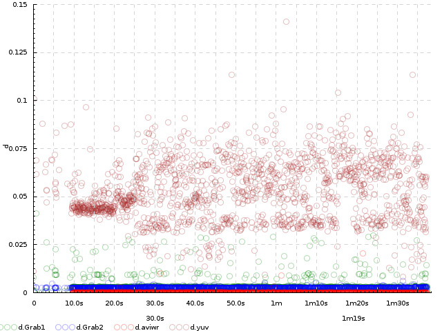

If you use ``-dk 'within[.] duration drop dots'``, you'll get this: 
 
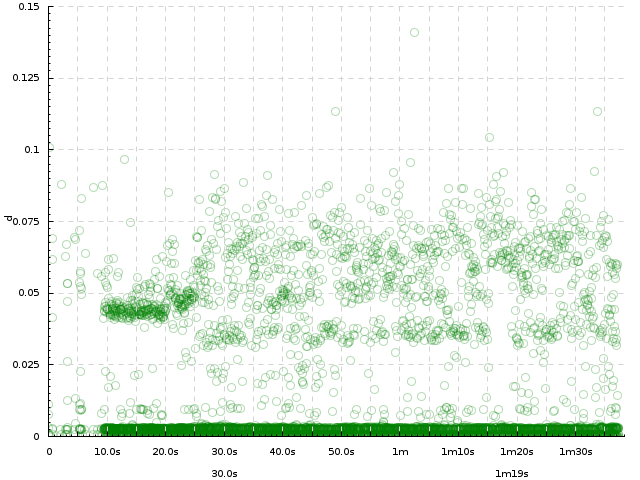

But this is likely not what you wanted.

On the other hand, suppose you're measuring the durations of **processing of requests themselves**. Then your log might say::

    .... >process.14ca3ef7
    .... <process.a28f3b13
    ....

In this hypothetical log, all request ids are unique (contrary to pipeline stage names in the previous example). So, if we try drawing a dot plot of their durations using ``-dk 'within[.] duration dots'``, we'll get a plot where every dot has a different color, which makes no sense (and is not even processible at all by plot types such as ``quantile``). That's what ``duration drop XXX`` is for: we can use ``-dk 'within[.] duration drop dots'`` and the output track ``process`` will contain durations of the requests with input track names not like ``process.14ca3ef7``, but simply ``process``, drawn in a single color.

**Chart for M:1 track mapping** — ``within``. This is not a chart kind proper, it's a means for displaying values from multiple input tracks on a single chart. It's often used with ``duration``. See section :ref:`tplot-track-mapping` .

Plot kinds for numeric data
^^^^^^^^^^^^^^^^^^^^^^^^^^^

All the following chart kinds work on numeric measurement events, i.e. events of the form ``.... =TRACK VALUE``, e.g. ``2012-08-07 18:04:35 =rtime 52.1``.

**Simple dot plot** — ``dots [ALPHA]``. When multiple input tracks map to this output track, the different input tracks are drawn with different colors. ``ALPHA`` is an optional opaqueness level: 0 means completely transparent, 1 means completely opaque. This helps to deal with overplotting, when there are too many values to display.

Example with 1 input track (``dots`` without alpha): response times of a search engine server are drawn.


Example with multiple input tracks (``dots`` without alpha and ``dots 0.2``):

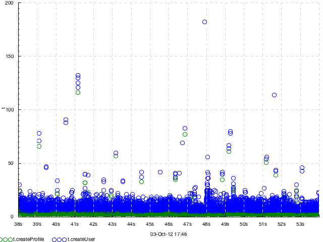

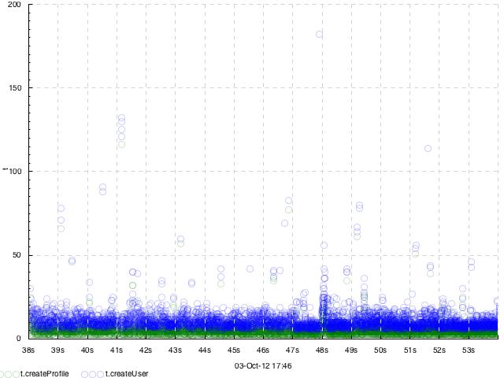

**Simple connected line plot** — ``lines``. Same as ``dots``, but the dots are connected. When multiple input tracks map to this output track, the different input tracks are drawn with different colors.

Example with 1 input track per output track (``-dk lines``): request execution times as seen by 1) the caller (**client**) and 2) the callee (**gateway**), plotted from a trace with events of the form ``=client 0.53``.

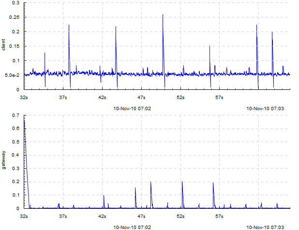

The graph suggests that, as these times are so different, most likely something is wrong with the RPC layer between them (indeed, it turned out a wrong RPC transport was used).

Example with several input tracks per output track (``-dk 'within[_] lines'``): measurements of 2 components of household power consumption — *active* and *reactive* power.

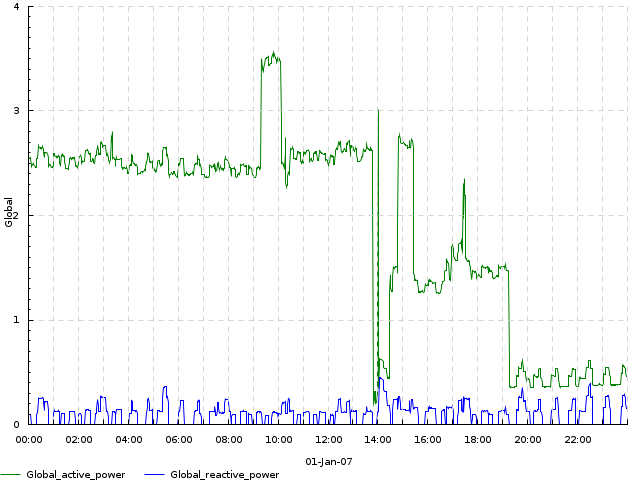

**Line plot of binned sum** — ``sum N [TYPE]`` — slice the time axis into N-second bins; draw a simple line plot of sums of values in each bin. When multiple input tracks map to this output track, sums for the different input tracks are drawn with different colors. If TYPE is ``overlayed``, subplots for the different input tracks are just overlayed on each other. If TYPE is ``stacked`` (default), they are *accumulated* so you can see how the total sum adds up from them. This is useful to understand, e.g., how big is the role of a step of some computation in the total time it takes. If the number of values per bin is usually the same, then ``sum`` also gives an impression of the average value.

Example with two tracks, on the same data as in ``dots``: ``sum 1 overlayed``

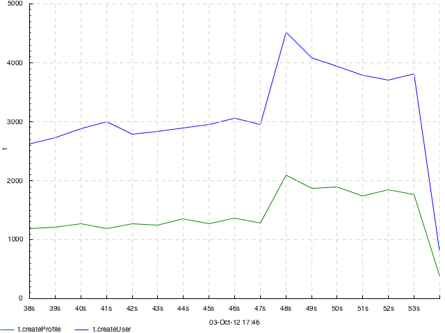

Same with ``sum 1 stacked`` or just ``sum 1``:

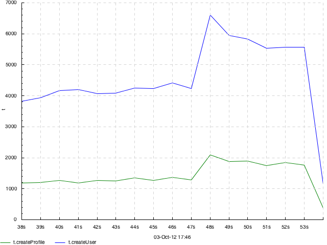

**Line plot of cumulative sum** — ``cumsum N [TYPE]`` — same as ``sum``, but accumulation happens not in every bin but from the beginning of time.

Example with two tracks, on the same data as in ``dots``: ``cumsum 1 overlayed``

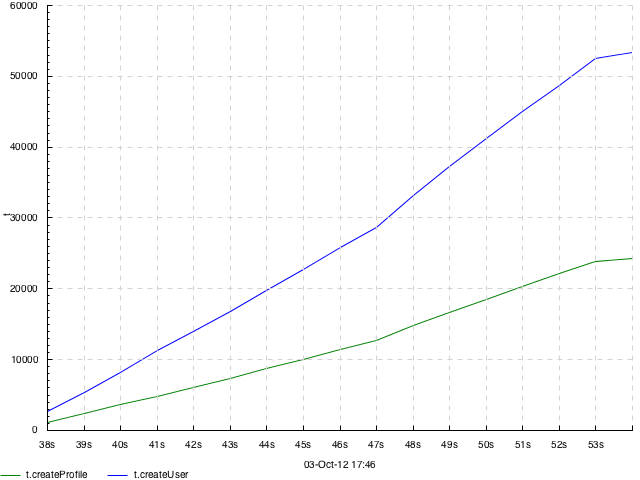

Same with ``cumsum 1 stacked`` or just ``cumsum 1``:

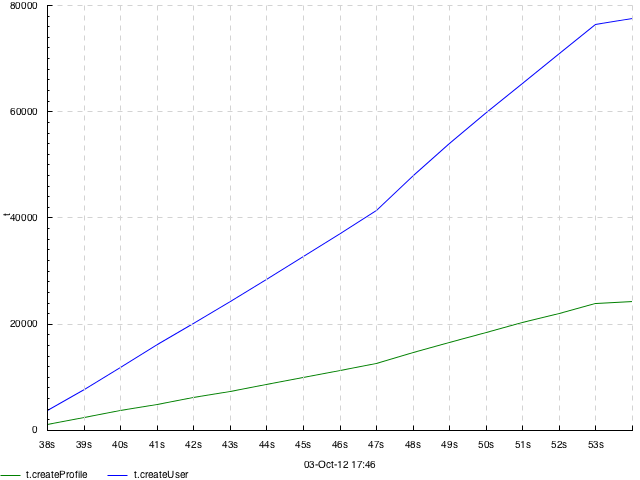

**Quantile plot** — ``quantile N`` :math:`q_1,q_2,..,q_M` — slice the time axis into N-second bins; draw a bar chart of :math:`q_1`'th, :math:`q_2`'th etc. percentiles of numeric values in each bin. All of :math:`q_1`, :math:`q_2` :math:`\ldots` are numbers between 0 and 1. For example, 0.75 means the 75% quantile, i.e. the value *x* such that 75% of the values in this bin are smaller than *x*. Obviously, the 0'th quantile is the minimum value in the bin, and the 1'th quantile is the maximum value. 0 and 1 are always implicitly added to the quantiles you specify.

Only 1 input track per output track is supported.

Specifically, within each bin, stacked bars of different color are drawn: :math:`0..q_1`, :math:`q_1..q_2`, :math:`\ldots`, :math:`q_M..1`. This means that the lower edge of what you see is the minimum value within that bin, and the upper edge is the maximum value; and bar boundaries correspond to the quantiles you asked for.

Example:

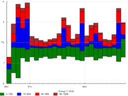

This is a chart of kind ``quantile 60 0.75,0.90,0.99``. The green bar spans from minimum in a bin to the 75% quantile, the blue bar starts at 75% and ends at 90%, the red bar starts at 90% and ends at 99% and the brown bar starts at 99% and ends at maximum. All this is reflected in the legend.

Another example:

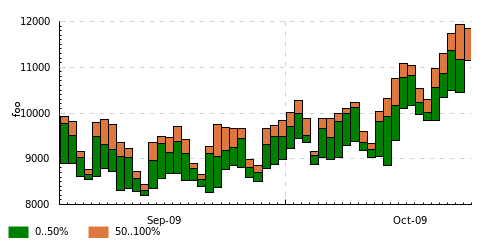

This was drawn with kind ``quantile 86400 0.5``. The green bar spans from day minimum to median and the brown bar spans from median to day maximum.

**Bin frequency plot** — ``binf N`` :math:`v_1,v_2,..,v_M` — slice time axis into N-second bins; draw a bar chart of frequencies of values falling into the bins :math:`<v_1`, :math:`v_1..v_2:`, :math:`\ldots`, :math:`>v_M`. Frequencies are numbers from 0 to 1, so they add up to 1, so the total height of the bars is always 1.

**Bin histogram plot** — ``binh N`` :math:`v_1,v_2,..,v_M` — same as ``binf``, but instead of frequencies, the absolute number of occurences of each bin is drawn.

For both of these, only 1 input track per output track is supported.

Example of both ``binh`` (top) and ``binf`` (bottom):

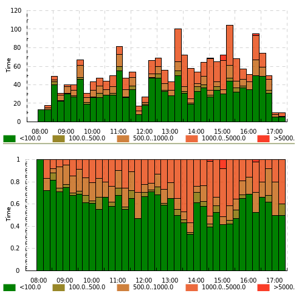

*(this graph was made with an old version of* **timeplot** *which had a pretty ugly color scheme)*

Here the same value (page download time by a web crawler) is drawn using both ``binf`` and ``binh``: we see how frequently the download took below 100ms, 100 to 500ms, 500 to 1000ms etc. On the top graph we see *what number* of pages took that much to download, and on the bottom graph we see *what fraction* of pages took that much. In different situations both of these can be useful.


Plot kinds for counters
^^^^^^^^^^^^^^^^^^^^^^^

**Event plot** — ``event`` — draw intervals delimited by ``>`` and ``<`` input events and markers according to ``@`` and ``!`` events. In the more complex case where ``>`` and ``<`` do not strictly alternate, they are interpreted as *+1* and *-1*-s to a counter and **timeplot** draws intervals when the counter is greater than zero. 

Only 1 input track per output track supported.

If you need to draw something similar to what ``event`` does, but more complex, you might consider using **splot** instead. ``@TRACK COLOR`` events act as ``>`` but the bar will have the indicated color. ``!TRACK`` will draw a vertical red dash and ``!TRACK TEXT`` will draw a red dash with a text label. 

Example (``-dk event``): a computation had to process 10 *sites*, processing at most 6 concurrently. Starting computations for a site was marked with ``>site-N`` and completion with ``<site-N``.

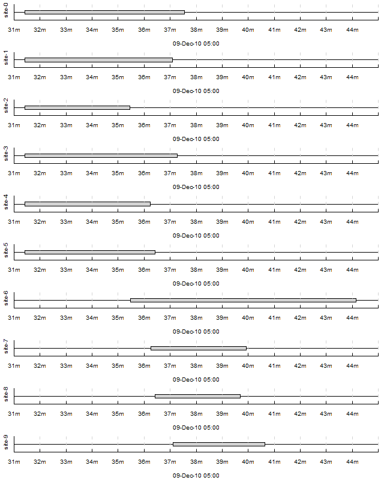

We can see that the computation suffered from unfortunate scheduling: ``site-6`` caused a 3-minute tail on its own. If it had been scheduled earlier, the computation would complete faster.


Example with ``!TRACK``: times of frame arrivals to different stages of a video processing pipeline.

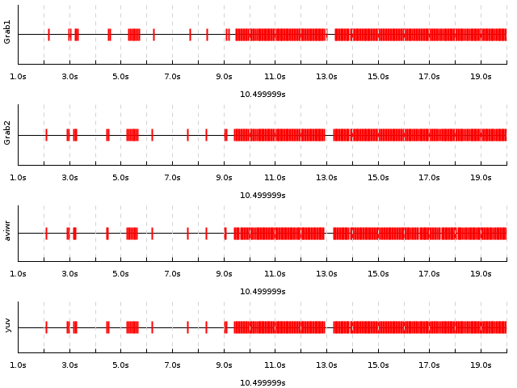

*I don't have any examples making use of* ``@TRACK COLOR`` *and* ``!TRACK TEXT`` *at the time. Sorry.*

**Average count / activity count** — ``acount N`` — slice the time axis into N-second bins; draw histograms of the number of activities specified by ``>``, ``<`` and ``!`` in each bin. More specifically:

 * Each input track mapping to this output track is interpreted as a counter
 * ``>`` means *+1*, ``<`` means *-1*, ``!`` are counted separately
 * In every bin, draw stacked bars: 1 bar per input track mapped to this output track (with a consistent coloring across bins), height of the bar is average value of the counter + number of ``!`` events in this bin (usually you *either* use ``>`` and ``<``, *or* ``!``), divided by bin width (so the graph gives *rate per second* and is scale-invariant under change of N).

Example with 1 input track per output track: ``acount 5``

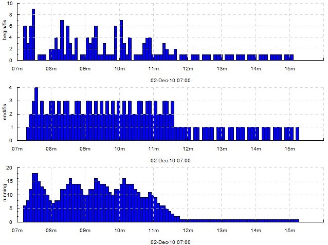

Here, we draw how many tasks are being 1) started 2) finished 3) currently running, for every 5 seconds. The trace looked like this::

    ...
    2010-12-02 07:08:15 !begin/5s
    2010-12-02 07:08:15 >running
    ...
    2010-12-02 07:08:18 !end/5s
    2010-12-02 07:08:18 <running
    ...

So, for the top two graphs we're counting ``!`` events and for the bottom graph we're looking at the average value of the counter bumped by ``>`` and ``<``.

Example with two input tracks per output track: ``within[.] acount 5``

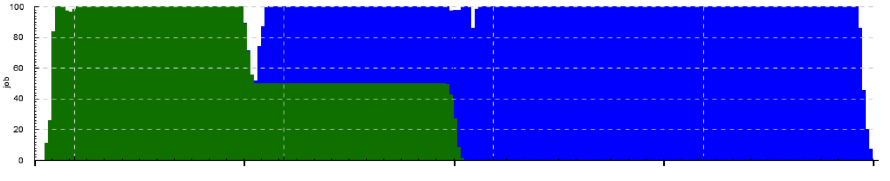

Here we see how the cluster is executing one job at full capacity, then another job comes in, preempts some of the first job's tasks and starts its own tasks there, etc. Each job's task starts are mapped to ``>job.JOBID`` and task completions are mapped to ``<job.JOBID``.

Example with several input tracks per output track: ``within[.] acount 5``

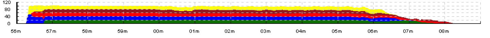

Here, a single job is being executed on a cluster with a task queue sharded into 4 sub-queues. The graph shows the number of concurrently executing tasks taken from each shard over time (every worker is attached to a single shard; when a task starts on a worker attached to queue shard S, an event ``>run.S`` is emitted; when it finishes, ``<run.S`` is emitted). We see that some shards deplete later than others.

**Average activity count as percentage** — ``apercent N X`` — exactly the same as ``acount N``, but the Y axis is scaled into percentages of X. Useful if e.g. you have X cores and you're counting what percent of them are busy running tasks delimited by ``>`` and ``<`` at any given moment.

Example with both 1 and several input tracks per output track: ``+k run 'apercent 60 420' +k run 'within[.] apercent 60 420'``

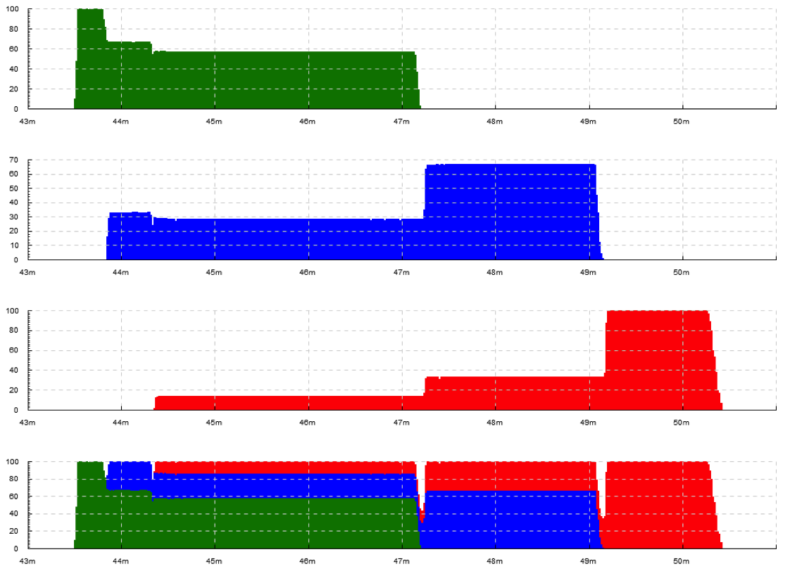

*The original log has been lost and only a picture with manually erased axis labels was left. Originally, there were labels on all axes. 1 tick on the X axis is actually 1 hour.*

Here, three jobs are being executed on a cluster with 420 cores. The graphs show utilization of the cluster (what percentage of cores are busy at any given moment) by the 3 jobs separately and as a whole. When a task starts, an event ``>run.JOBID`` is emitted; when a task completes, ``<run.JOBID`` is emitted.

To understand how we get three plots here (1 per job and 2 for both together), see section :ref:`tplot-track-mapping` .

**Average relative activity frequency** — ``afreq N`` — same as ``acount N``, but in each bin the heights of bars for different input tracks are normalized to add up to 1. So, this graph is useless if you have just 1 input track mapped to the output track, but if you have many, it shows you the ratio between intensity of different activities.

Example: absolute and relative frequency of database transactions performed by different threads: ``+dk '+abs within[.] acount 5' +dk '+rel within[.] afreq 5'`` *(see* :ref:`tplot-track-mapping` *to understand what this means)* Here, log entries saying *database transaction started by thread T* (e.g. ``mth:2``) are mapped to ``!tx.THREAD``.

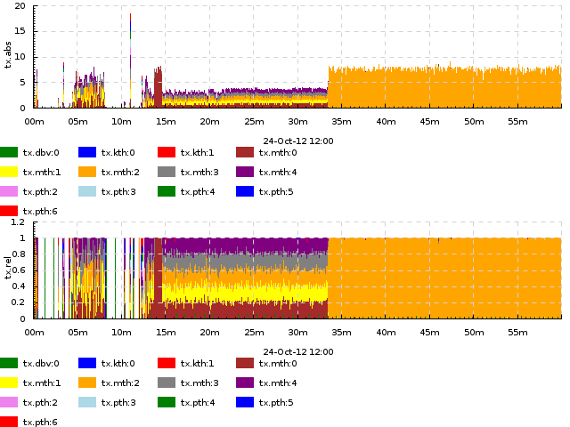

Plot kinds for discrete data
^^^^^^^^^^^^^^^^^^^^^^^^^^^^

**Discrete value frequency** — ``freq N TYPE`` — slice the time axis into N-second bind; within each bin, draw bars proportionally to the frequencies of different values of a discrete variable (``\``` events). Multiple input tracks per output track are not supported. If TYPE is ``clustered``, the bars are drawn next to each other; if TYPE is ``stacked`` (default), they are stacked vertically and add up to 1.


**Discrete value histogram** — ``hist N TYPE`` — same as ``freq N TYPE``, but absolute numbers of occuresnces of each value are drawn rather than the frequencies.

Example: ``hist 60``

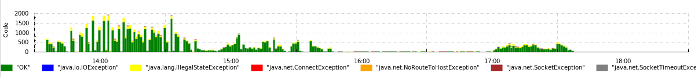

Here, we draw the frequency of different outcomes of page downloads by a web crawler written in Java. The input trace consists of events like ``=Code `OK``, ``=Code `java.io.IOException`` etc.

These two kinds can be emulated by ``acount`` and ``afreq``: a chart of kind ``freq N`` over events ``=foo `BAR`` is equivalent to a chart of kind ``within[.] afreq N`` over events ``!foo.BAR``.

.. _tplot-track-mapping:

Track and plot kind mapping
----------------------------

The process of mapping input events to output tracks consists of several steps. We'll understand it by describing the mapping algorithm and demonstrating it on a few simple examples involving the different parts of the algorithm.

Here's what happens to every input event (assume the event's input track is TRACK):

* Compare it to **all** the patterns of the form ``+k PATTERN '+SUF TYPE'`` (``+SUF`` can be omitted, then ``SUF`` is assumed empty). For those that match:

  * If ``TYPE`` is ``within[#] SUBTYPE``, and ``TRACK`` is of the form ``BASE#SUB``, place the event onto output track ``BASE.SUF`` .
  
  * Otherwise, place the event onto output track ``TRACK.SUF`` .

* Do the same for ``+dk '+SUF TYPE'``.

* Do the same for the **first** matching pattern among ``-k PATTERN '+SUF TYPE'`` .

* If no ``-k`` patterns matched, do the same for ``-dk`` .

An output track is drawn using the plot type specified by the first ``k`` or ``dk`` clause which emitted an event onto the output track.

To understand this, compare it to the simple special cases shown below.

**Simplest case, single input track and single plot type:** 1 input track, 1 plot kind mapping — the *default* mapping specified by ``-dk K``. This sole input track should be drawn with plot kind K (e.g. ``-dk dots``). We'll have 1 dot plot in the output, showing events from the sole input track.


**Multiple input tracks, single plot type:** Several input tracks, 1 default plot kind mapping. We get several plots of the same type (e.g. several dot plots) vertically stacked with a common time axis. **Example:** if we have several memcached servers and we measure the durations of requests to them, we can have input tracks named ``rtime.mcd1``, ``rtime.mcd2`` etc., and draw them, again, using ``-dk dots``.

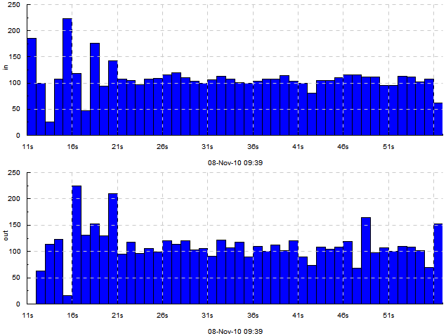

**Multiple input tracks with different plot types:** We wish to draw some input tracks with one plot type and some with another. We specify several regex/type mappings using ``-k PATTERN TYPE``. 

E.g. if we also have an input track ``cache`` with discrete measurement events ```HIT`` and ```MISS`` and we wish to draw their rate, we can use ``-k rtime dots`` ``-k cache 'freq 1'``. Then the output will have vertically stacked dot plots for tracks ``rtime.mcd1``, ``rtime.mcd2`` etc, and a frequency plot for the track ``cache``. 

Input tracks that don't match any ``-k`` patterns get drawn using the default plot type specified by ``-dk``.

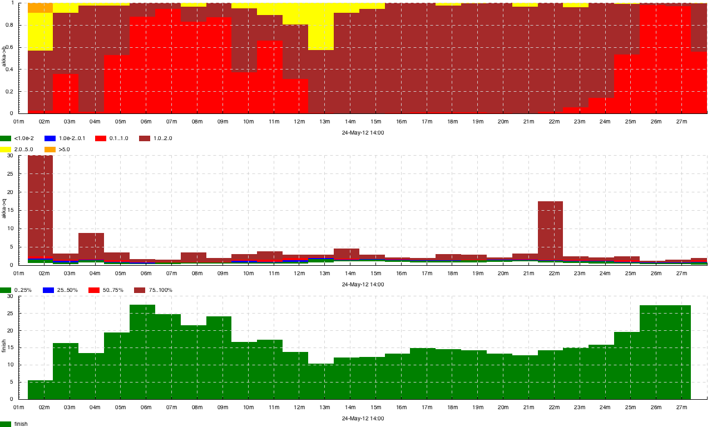

**Single input track drawn with several different plot types:** We wish to make events from a single input track participate in multiple output plots, e.g. draw both the absolute and relative frequency of a track of discrete measurement events. Then we use ``+k PATTERN '+SUF TYPE'``. This means *for tracks that match PATTERN, append .SUF to their name and draw a plot of type TYPE*. 

For example: ``+k cache '+f freq 1'`` ``+k cache '+h hist 1'`` will produce two output tracks: ``cache.f`` drawn with plot type ``freq 1`` and ``cache.h`` drawn with plot type ``hist 1``. Or, if (for some reason) you decide to draw both a dot and line plot of request times, you can try ``+k rtime '+dot dots'`` ``+k rtime '+line lines'`` and get tracks ``rtime.mcd1.dot``, ``rtime.mcd2.dot`` ... drawn with ``dots`` and ``rtime.mcd1.line``... drawn with ``lines``. 


There's also ``+dk '+SUF TYPE'`` with similar semantics. 

The suffixes are needed because otherwise the names of output tracks for the different plot types specified by ``+k`` for a single input track would be identical, i.e. it would be the same output track, **timeplot** cannot have two identically named output tracks. If the suffix is not specified (e.g. ``+k rtime dots``) it is assumed to be empty.

**Events from several similarly named input tracks drawn on a single plot:** Assume that you wish to draw dot plots of request times to different memcached servers not on several vertically stacked plots, but on a single dot plot, with different servers color-coded. Assume again that the input tracks are named ``rtime.SERVER``. 

Then you should use the ``within[SEP]`` plot meta-type: ``-k rtime 'within[.] dots'``. This means: map input tracks to output tracks by dropping everything after the separator ``SEP``, in this case after ``.``, and we get a single output track ``rtime`` to which go all the events from ``rtime.mcd1``, ``rtime.mcd2`` etc. The plot type ``dots`` will then take care of color-coding the different input tracks within a single output track. Other plot types deal with this situation in a sensible manner too, see section :ref:`tplot-plot-kinds` .


Option reference
------------------

.. list-table:: Option reference
  :widths: 5 20 5
  :header-rows: 1

  * - Option
    - Meaning
    - Default value
  * - ``--help``
    - Show help
    -
  * - ``--version``
    - Show version information
    -
  * - ``-if INFILE``
    - Input filename. ``-`` means read from stdin. Do not use ``-`` for large inputs (above :math:`\approx 100,000` events)! **timeplot** can only work well on large inputs if the input is in a file.
    - *Required*
  * - ``-o OUTFILE``
    - Output filename with extension
    - *Required*
  * - ``-of FORMAT`` 
    - Output format: ``svg``, ``png``, ``pdf``, ``ps`` 
    - Extension of ``-o`` 
  * - ``-or WIDTHxHEIGHT`` 
    - Output resolution, e.g. ``640x480`` 
    - Extension of ``-o`` 
  * - ``-tf PATTERN`` 
    - Format of time in the input file as in `man strptime <http://linux.die.net/man/3/strptime>`_ but with fractional seconds supported via ``%OS`` — will parse ``12.4039`` or ``12,4039``.  Also, ``%\^[+-][N]s`` will parse seconds since the epoch, for example ``%\^-3s`` are milliseconds since the epoch (N can only be 1 digit) 
    - ``%Y-%m-%d %H:%M:%OS`` 
  * - ``-dk KIND`` 
    - Default diagram kind. Do not forget to quote it! See section :ref:`tplot-track-mapping` . 
    - None 
  * - ``+dk KIND`` 
    - --- 
    - None 
  * - ``-k PATTERN KIND`` 
    - Diagram kind for pattern PATTERN. See section :ref:`tplot-track-mapping` . 
    - None 
  * - ``+k PATTERN KIND`` 
    - --- 
    - None 
  * - ``-fromTime TIME`` 
    - Filter events whose time is :math:`\ge` this time. Format specified by ``-tf``. 
    - None (no filter) 
  * - ``-toTime TIME`` 
    - Filter events whose time is :math:`\le` this time. Format specified by ``-tf``. 
    - None (no filter) 
  * - ``-baseTime TIME`` 
    - Draw time axis labels as seconds elapsed since TIME, instead of absolute time. Format specified by ``-tf``. 
    - None 

Example data and exercises
---------------------------
In this section we list some example datasources and exercises to try on them. **WARNING:** The section :ref:`tplot-gallery` has solutions to many of the exercises. Don't look at graphs marked *exercise* if you don't want a spoiler.

Consumer power consumption.
^^^^^^^^^^^^^^^^^^^^^^^^^^^
http://archive.ics.uci.edu/ml/datasets/Individual+household+electric+power+consumption. This dataset contains measurements of power consumption of a single household, measuring several characteristics over the course of several years. It's in a simple CSV format which is described at the link. Beware: some data is not available and there are question marks in place of missing data items. You can completely skip such rows for the purpose of this exercise.

**Excerpt from the log**::

    Date;Time;Global_active_power;Global_reactive_power;Voltage;Global_intensity;Sub_metering_1;Sub_metering_2;Sub_metering_3
    16/12/2006;17:24:00;4.216;0.418;234.840;18.400;0.000;1.000;17.000
    16/12/2006;17:25:00;5.360;0.436;233.630;23.000;0.000;1.000;16.000
    16/12/2006;17:26:00;5.374;0.498;233.290;23.000;0.000;2.000;17.000
    16/12/2006;17:27:00;5.388;0.502;233.740;23.000;0.000;1.000;17.000
    16/12/2006;17:28:00;3.666;0.528;235.680;15.800;0.000;1.000;17.000

**Exercise 1.** Make a dot plot of ``Voltage`` for January 1st, 2007. Do not limit *the trace*, use ``-fromTime`` and ``-toTime``. :download:`Expected result <pics/tplot/power-voltage.png>`

**Exercise 2.** Make a line plot of ``Global_active_power`` vs ``Global_reactive_power`` on one plot and a line plot of ``Voltage`` on another (i.e., the result should be a stack of two plots), for January 1st, 2007. Use an opacity level of 0.5. :download:`Expected result <pics/tplot/power-active-reactive-voltage.png>`

**Exercise 3.** Make a quantile plot, with quantiles of 0.1, 0.5 and 0.9 over bins of 1 day, for ``Global_active_power`` and ``Voltage``, for the entire dataset. :download:`Expected result <pics/tplot/power-voltage-quantile.png>`

Video encoding
^^^^^^^^^^^^^^^
*This dataset generously provided by Dmitry Popov.* http://jkff.info/datasets/dmitry-popov-video-encoding.tar.gz. This is a set of logs of a video encoding pipeline. For every video sample, the log contains times that this sample entered several steps of the pipeline: ``Grab1``, ``Grab2``, ``SR.YUV`` and ``AviWr``. The three logs show how the same video was encoded with 3 versions of the program after different optimizations.

**Excerpt from the log:**
This excerpt shows all entries in the log ``1.txt`` relating to sample ``[0]``. In the full log, entries for all samples are intermixed. Use column 1 as the timestamp::

    0.000000 (0.000000) (0.000000) Grab1 sample [0] 0.000000, locking..
    0.000006 (0.000006) (0.000006) Grab1 [0] got lock, carry on..
    0.000611 (0.000604) (0.000611) Grab1 [0] sample processed.
    0.000615 (0.000000) (0.000615) Par1.In received sample [0]
    0.000629 (0.000000) (0.000629) SR.YUV got sample [0]
    0.011636 (0.011007) (0.011636) SR.YUV done with sample [0]
    0.011643 (0.000000) (0.011643) ParLast.In received sample [0]
    0.011661 (0.000000) (0.011661) Grab2 sample [0] 0.000000, locking..
    0.011666 (0.000005) (0.011666) Grab2 [0] got lock, carry on..
    0.014947 (0.003280) (0.014947) Grab2 [0] sample processed.
    0.598770 (0.000000) (0.598770) AviWr.V video sample [0] received
    9.736371 (0.000466) (9.736371) AviWr.V [0] WriteVideo, locking..
    9.736373 (0.000001) (9.736373) AviWr.V [0] got lock, writing..
    9.736460 (0.000086) (9.736460) AviWr.V [0] write complete.

**Exercise 1.** Plot the number of samples arriving per second to ``Grab1``, ``Grab2``, ``SR.YUV`` and ``AviWr``. :download:`Expected result <pics/tplot/thedeemon-acount.png>`

**Exercise 2.** Make an event plot, using impulse events for sample arrivals to these stages. Limit to the first 20 seconds. :download:`Expected result <pics/tplot/thedeemon-event.png>`

**Exercise 3.** Make 4 dot plots for durations of processing at these stages. :download:`Expected result <pics/tplot/thedeemon-dots.png>`

**Exercise 4.** Plot the same, but on a single plot (hint: use ``within``). :download:`Expected result <pics/tplot/thedeemon-dots-all.png>`

DrWeb log
^^^^^^^^^^
*This log was generously provided by Paul Graphov.* http://jkff.info/datasets/paul-graphov-drweb.tar.gz. This is a log of DrWeb Antivirus Server, and the most interesting entries in it are those relating to TCP data flow and to DB transactions::

    20121024.114904.78 db3 [  415   448] mth:1  ...:ANTON-WIN7RU: data arrived, 32b
    20121024.114904.78 tr2 [  415   448] mth:1  ...:ANTON-WIN7RU: rcv 17 GETTIME(6348666174470429760) 0b data
    20121024.114904.78 db3 [  415   448] mth:1  ...:ANTON-WIN7RU: cancel timeout, GETTIME
    20121024.114904.78 tr2 [  415   448] mth:1  ...:ANTON-WIN7RU: cmd (49b) "11 TIME 6348666174470429760 6348666174478278600"
    20121024.114904.78 db3 [  415   448] mth:1  ...:ANTON-WIN7RU: cancel timeout, prolongate
    20121024.114904.78 db3 [  415   448] mth:1  ...:ANTON-WIN7RU: set timeout to 60000 ms <6348666180478295800>
    20121024.114904.78 db3 [  415   449] mth:2  ...:ANTON-WIN7RU: data arrived, 14b

and::

    20121024.114904.78 db3 [  415   449] mth:2  [DB] Successful BEGIN transaction, 00.000 wait
    20121024.114904.78 db3 [  415   449] mth:2  [IntDB] Statement "..."
    20121024.114904.78 db3 [  415   449] mth:2  [DB] OK, 00.000, ...
    20121024.114904.78 db3 [  415   449] mth:2  [IntDB] Statement "..."
    20121024.114904.78 db2 [  415   449] mth:2  [DB] 1 row, 00.000, ...
    20121024.114904.78 db3 [  415   449] mth:2  [IntDB] Statement "..."
    20121024.114904.78 db2 [  415   449] mth:2  [DB] 79 rows, 00.000, ...
    20121024.114904.78 db3 [  415   449] mth:2  [IntDB] Statement "COMMIT"
    20121024.114904.78 db3 [  415   449] mth:2  [DB] Database has been freed but nobody wants it now 
    20121024.114904.78 db3 [  415   449] mth:2  [DB] Successful COMMIT transaction, 3 statements, 00.000 wait, 00.000 execute, 00.000 commit

**Exercise 1.** Plot the data arrival rate (according to ``data arrived`` entries) per 5-second bins (use ``sum``). :download:`Expected result <pics/tplot/graphov-arrival.png>`

**Exercise 2.** Plot the transaction commit rate (according to ``Successful COMMIT`` entries) per 5-second bins. :download:`Expected result <pics/tplot/graphov-txcommit.png>`

**Exercise 3.** Plot the same transaction commit rate, but so that we can see how it adds up from contributions by different threads (``mth:1``, ``pth:2`` etc.). Limit to the interval from 12:00 to 13:00. :download:`Expected result <pics/tplot/graphov-txcommit-bythread.png>`

**Exercise 4.** Same as above, *and use the same trace file*, but make it 1 plot per thread type (``mth``, ``pth``, ``dbv`` etc., but still with a breakdown *by thread* within each type's plot). :download:`Expected result <pics/tplot/graphov-txcommit-bythreadtype.png>`

.. _tplot-gallery:

Gallery
---------
Look for plots that seem like what you want. Consult sections :ref:`tplot-input-format` , :ref:`tplot-plot-kinds` and :ref:`tplot-track-mapping` .

Simplest numeric plots and basic track mapping
^^^^^^^^^^^^^^^^^^^^^^^^^^^^^^^^^^^^^^^^^^^^^^^


  A dot plot of request execution times.
  1 input track, 1 output track. Events look like
  ``=arc 1542``, plot type ``-dk dots``.
  Data provided by Julia Astakhova


  A dot plot of two parts of request execution times.
  2 input tracks, 1 output track. Events look like
  ``=t.createUser 25`` or ``=t.createProfile 7``, plot type
  ``-dk 'within[.] dots'``. Data provided by Julia Astakhova.


  Same as above but with transparency. Plot type
  ``-dk 'within[.] dots 0.2'``


  Distribution of page download times by a web crawler — how many take :math:`<100` ms, :math:`100..500` etc. this is actually 2 different picture stitched together. each had 1 input track with events like ``=time 254.1``. Drawn with ``-dk 'binh 900'`` and ``-dk 'binf 900'`` correspondingly (15-minute slices).


  
  Distribution of request execution times and rate of request completions per minute in an akka program. events look like ``>akka.THREADID``, ``<akka.THREADID`` and ``!finish``, plot type ``+k akka '+b within[.] duration drop binf 60 0.01,0.1,1,2,5' +k akka '+q within[.] duration drop quantile 60 0.25,0.5,0.75' -k finish 'acount 60'``. Data provided by arnaud bailly.


  Change of some super-secret value at Yandex over time: per-day min, max and median are shown. Events look like ``=foo 9350``, plot type ``-dk 'quantile 86400 0.5'``.

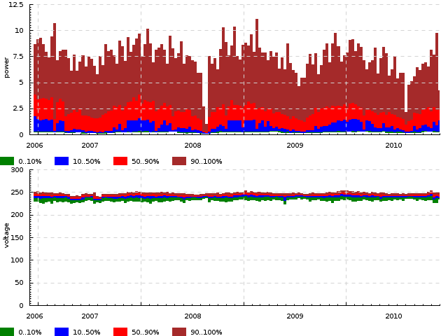

  **EXERCISE.** Per-day quantiles of power and voltage consumed by 1 household for a year. Events look like ``=power 5.6`` and ``=voltage 245.2``, plot type ``-dk 'quantile 86400 0.1,0.5,0.9'``.

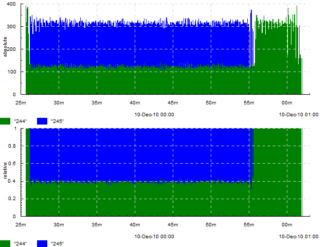

  Absolute and relative number of task completions of two on a cluster per second. Events look like ``=absolute `244`` and ``=relative `244`` (this was before **timeplot** had the ``+k`` construction, so events had to be duplicated), plot type ``-k absolute 'hist 1' -k relative 'freq 1'``.


  Number of different exception types encountered by a web crawler. Events look like ``=Code `java.net.SocketException``, plot type ``-dk 'hist 60'``.


  Activity of 8 *computation sites* to be processed. Events look like ``>site-5``, ``<site-5``, plot type ``-dk event``.


  **EXERCISE.** Frame arrival times to several stages of a video encoding pipeline. Events look like ``!Grab2``, plot type ``-dk event``.

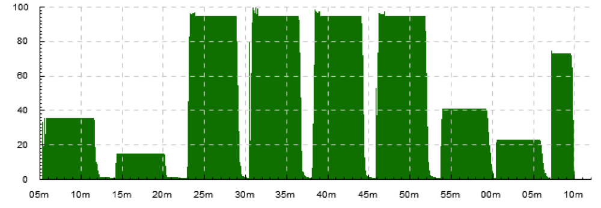

  Number of concurrently running tasks on a cluster. Events look like ``>running``, ``<running``, plot type ``-dk 'acount 5'``.


  Number of tasks started and finished per second on a cluster. Events look like ``!in`` and ``!out``, plot type ``-dk 'acount 1'``


  Number of tasks started, finished and concurrently running per second on a cluster. Events look like ``!begin/5s``, ``!end/5s``, ``>running`` and ``<running``, plot type ``-dk 'acount 5'``

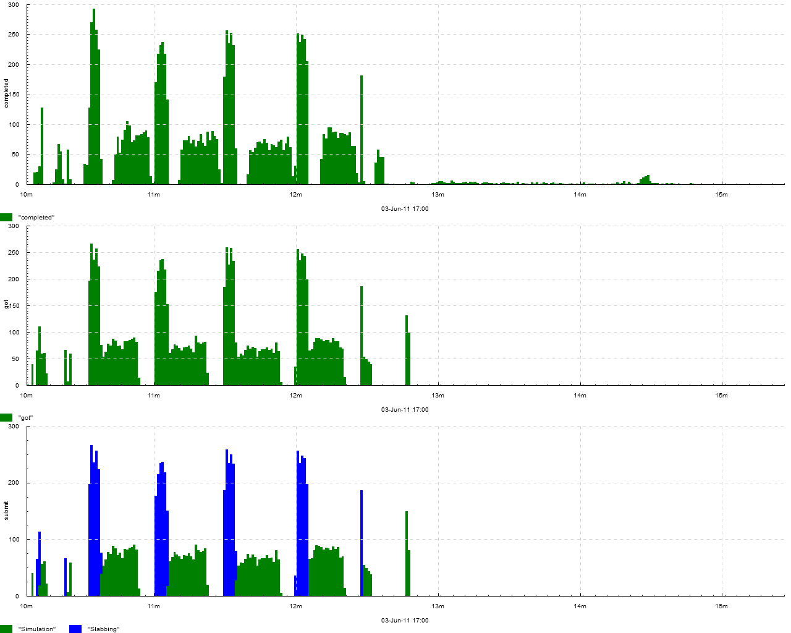

  Number of tasks received, completed and submitted (with breakdown by *task type* — *simulation* or *slabbing*) on a cluster. Events look like ``!got``, ``!completed``, ``!submit.Simulation`` and ``!submit.Slabbing``, plot type ``-k submit 'within[.] acount 1' -dk 'acount 1'``.

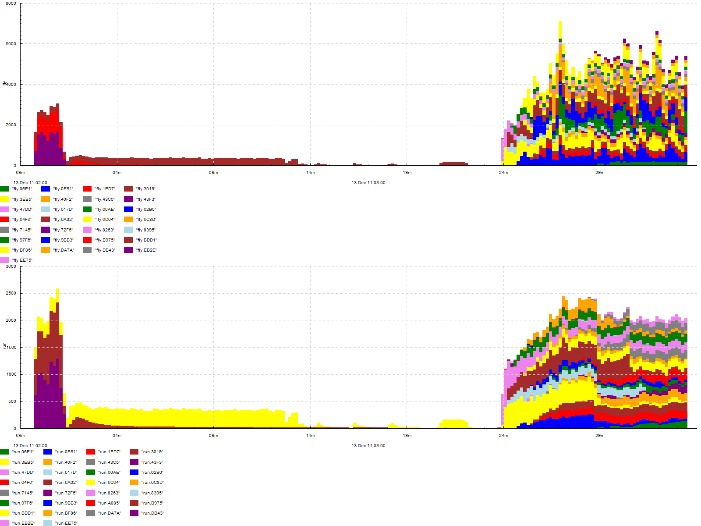

  Number of tasks *in queue* and *in progress* on a cluster, with breakdown by job id. Events look like ``>fly.JOBID``, ``<fly.JOBID``, ``>run.JOBID`` and ``<run.JOBID``, plot type ``-dk 'within[.] acount 5'``

.. figure:: pics/tplot/graphov-txcommit-bythread.png
  :width: 50%
  :align: center

  **EXERCISE.** Number of DB transaction commits per second performed from several threads. Events look like ``!tx.mth:3``, plot type ``-dk 'within[.] acount 1'``

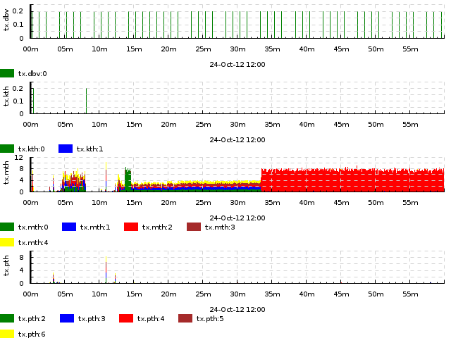

  **EXERCISE.** Number of DB transaction commits per second performed from several threads, classified by thread type. Events look like ``!tx.mth:3``, plot type ``-dk 'within[:] acount 1'``

